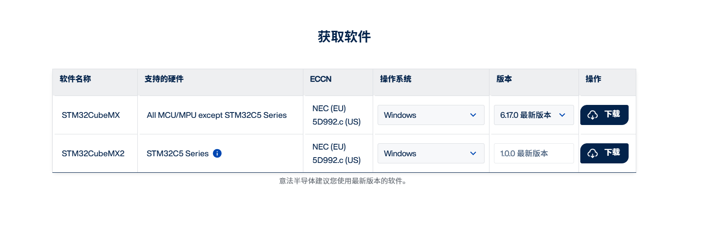
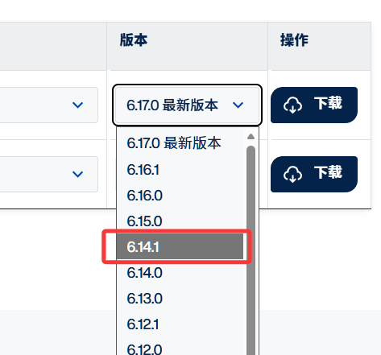
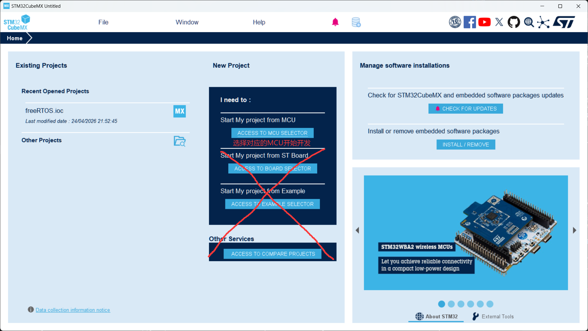
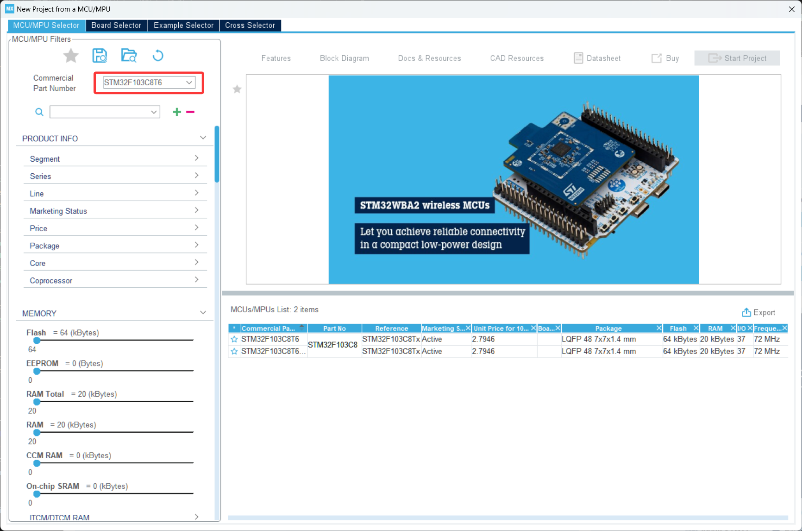
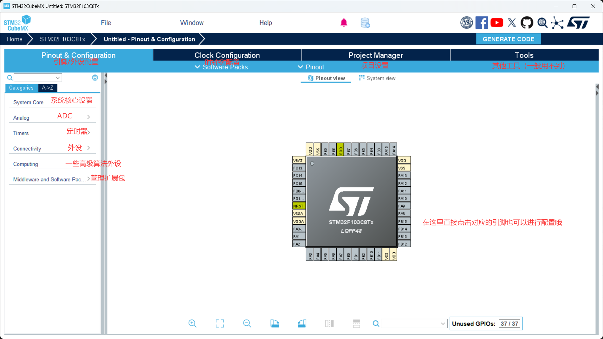
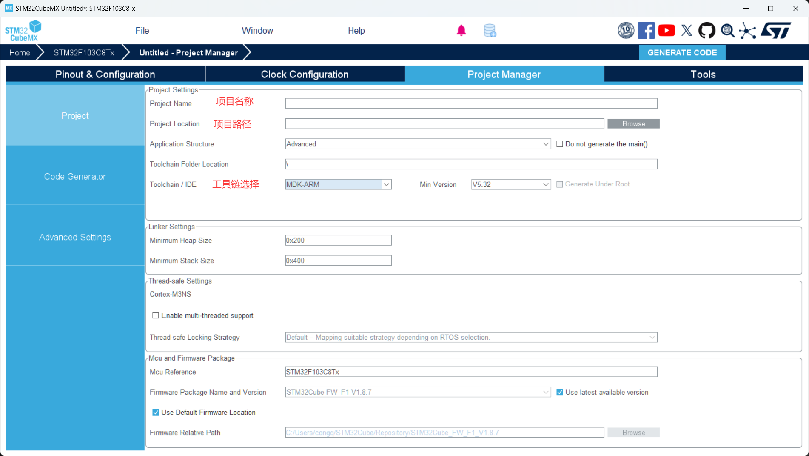

# 第 1 节 · 图形化外设配置：CubeMX

> 本节目标：学会如何使用CubeMX新建一个工程。

## CubeMX 到底帮你做了什么

CubeMX 不是编译器，它做的是三件事：

- 帮你选择芯片和封装。
- 帮你配置引脚复用、时钟树和外设参数。
- 生成 HAL / LL 初始化代码和工程框架。

对初学者来说，最大价值不是“自动写代码”，而是把容易配错的底层参数集中到图形界面里。

## 如何下载安装CubeMX？

1. 进入[CubeMX官网](https://www.st.com.cn/zh/development-tools/stm32cubemx.html)
2. 找到 **获取软件**
3. 下载STM32CubeMX，6.14.1版本(为什么不下最新版？因为最新版有一些功能被删掉啦！)
4. 可能会弹出要你登录，直接注册或者登录就行，登陆后进行下载
5. 安装软件，一直下一步即可

## CubeMX如何使用？

1. 打开 CubeMX，你会看到这个界面，只需要这个按钮可以选择MCU新建工程即可
2. 之后进入到选择芯片界面，在左上角的搜索框搜索对应的芯片即可在右侧选择芯片，双击就能进入到下一步
3. 到这一步，我们就已经来到了正式配置工程的界面，本小节不会教大家具体的配置用法，后续的教程会用到哪讲到哪
4. 在 Project Manager 中设置工程名、生成路径和工具链
5. 点击 Generate Code即可生成一个全新的项目。

## 一个常见习惯

每做完一次稳定配置，就保留一份 `.ioc` 文件和能编译通过的工程快照。这样以后改坏了，可以直接回退到最近可用状态，而不是从零重配。

## 本节小结

CubeMX 的核心不是“点按钮”，而是建立一个正确、可再生的底层配置。后面第二章的每个实验，基本都要回到这里改外设设置。