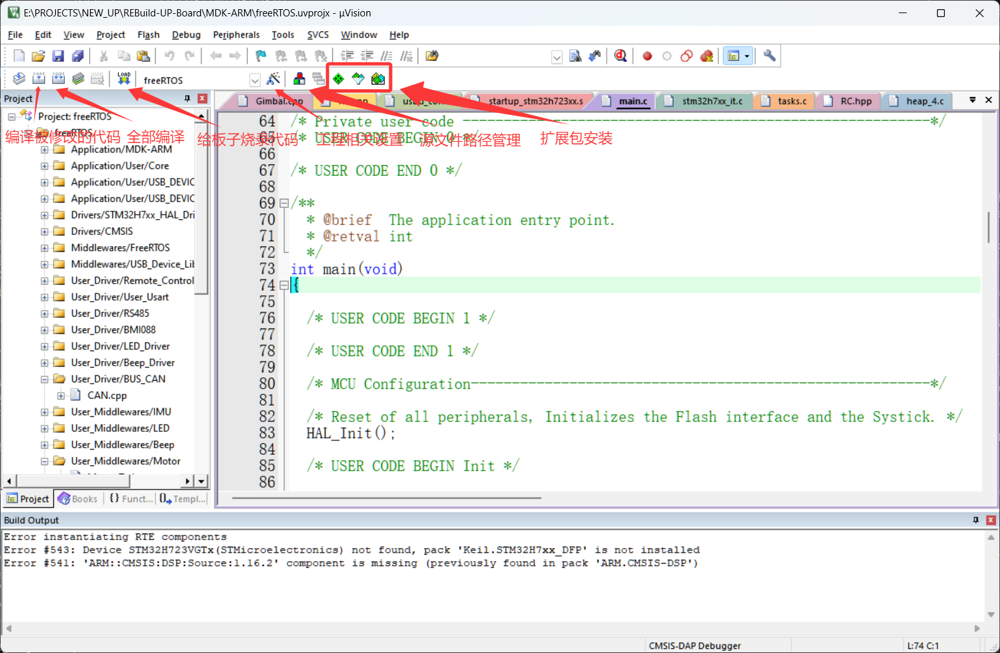

# 第 2 节 · 传统且稳定的编译器：Keil

> 本节目标：下载并配置好keil的编译器。

## 现代的开发方式那么多，为什么很多"老一辈"还在用 Keil？

Keil 的优点非常直接：

- 集成度高，装完后很快就能跑通。
- 示例多，老项目多，遇到问题更容易搜到现成经验。
- 对纯 HAL 工程和比赛训练项目很友好。

它并不是最现代的工具，但在“先做出结果”这件事上依然很强。

## 下载与安装Keil

1. 进入[Keil的官网](https://www.keil.com/)
2. 下载并安装Keil(这步没什么特殊的，一直下一步就行)
3. 按照[教程](https://zhuanlan.zhihu.com/p/632808837)给Keil安装5代编译器，我们队里大部分老代码还是基于5代编译器构建的

## Keil 的典型使用方式

在 CubeMX 的 Project Manager 中把 Toolchain 选择成 MDK-ARM，生成后直接打开 `.uvprojx`。

## 第一次打开工程

1. 打开从CubeMX生成的工程，Keil会自动安装所需要的资源包
2. 参考图片，这些是keil的常用功能按钮
3. 编译一下代码(两种编译都可以)，看看CubeMX生成的是否正确

到这里，我们的Keil的安装就已经完成了，剩下的部分(AI生成的，可能会错)可以选择性阅读，因为后面遇到了还会具体再讲

## 调试时最值得用的功能

- 断点：确认代码到底跑没跑到这里。
- Watch：盯变量的变化，而不是全靠猜。
- Memory：看寄存器或内存是否真被改动。
- Step Over / Step Into：理清函数执行顺序。

## 常见问题

| 问题 | 排查方向 |
| --- | --- |
| 工程打不开 | 设备包缺失、版本过旧 |
| 下载失败 | ST-Link 驱动、SWD 接线、芯片供电 |
| 中文路径报错 | 把工程移动到纯英文路径 |
| 改了 CubeMX 配置后丢代码 | 用户逻辑没放到 USER CODE 区间 |

## 什么时候该考虑切换工具链

当你的项目开始需要：

- 更灵活的目录结构。
- 更方便的多人协作。
- 更好的代码搜索、跳转和静态检查体验。

这时候就可以继续看下一节的 CMake + VS Code。