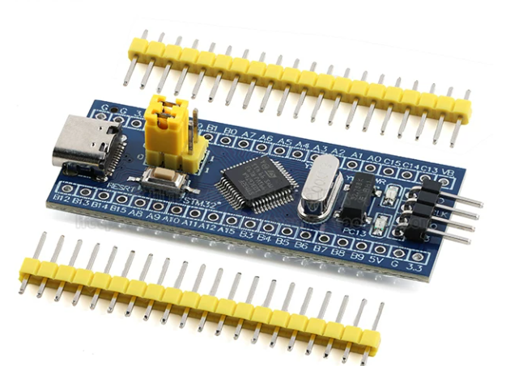
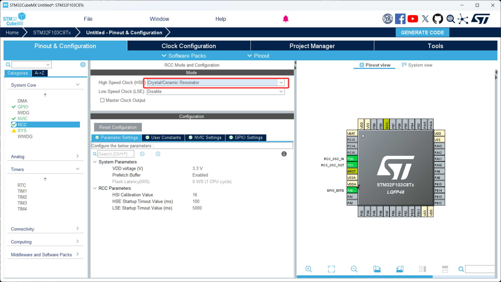
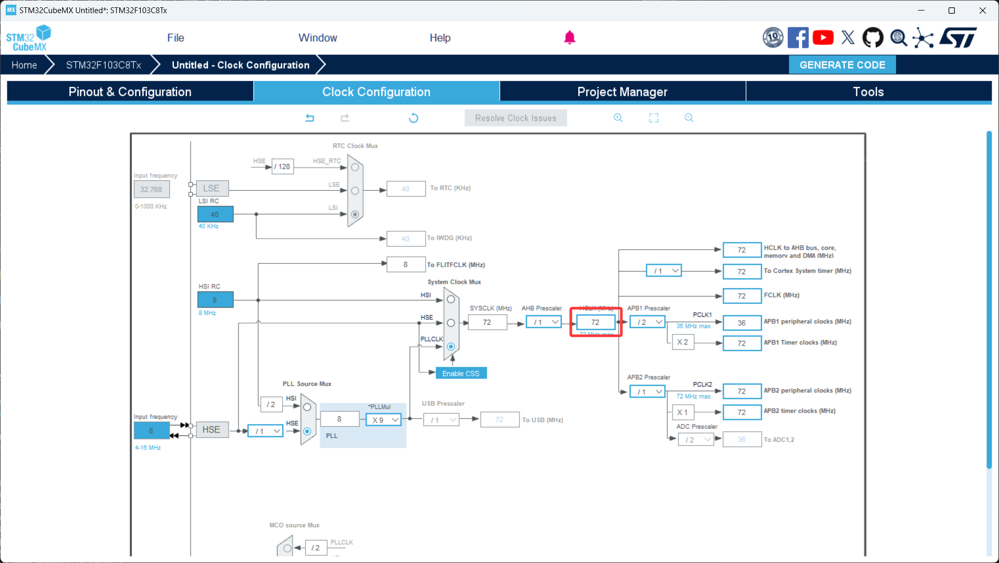

# 第 0 节 · 没摸过就不算上手：认识小蓝板（STM32F103C8T6）

> 本节目标：先认识你接下来一整章会一直打交道的这块板子，理解它的内核和外设资源，记住下载、供电、关键引脚的位置，做到拿到板子能对照实物认得出。

> 从本节开始，如有对应的推荐教程，将在上方出现跳转按钮，可以按需选择观看

## 了解小蓝板是什么

小蓝板是基于 STM32F103C8T6 这颗芯片做的最小系统板，因为板子是蓝色的、价格便宜（十块钱左右）、社区资料多，所以成了国内 STM32 入门最常见的练手板。

通俗地讲，它就是一块"已经把芯片、晶振、复位电路、USB 接口都接好的开发板"，你只需要拿杜邦线接外设、用 ST-Link 下载程序就能开始跑代码，不用自己画板焊电路。

那么这里有个问题，既然 STM32 系列芯片型号那么多（F0/F1/F4/F7/H7...），我为什么非要从 F103 开始学？

答案是因为 F103 性能、资源、价格三者最平衡。它内核足够强能跑大多数入门项目，外设和高端型号原理一致，HAL 库 API 完全兼容，但价格只有几块钱坏了不心疼。等你把 F103 玩熟，迁移到 F407、H743 这类高端型号几乎不用重新学，最多换几个寄存器名。

### 内核与主频

STM32F103C8T6 用的是 ARM Cortex-M3 内核，最高主频 72MHz。简单说：

M3 内核：32 位、带硬件除法、不带浮点单元（FPU）。需要做大量浮点运算请上 F4。

72MHz 主频：相比 8 位机的 16MHz 已经快了一个量级，跑常规通信、控制、显示完全够用。

### Flash 与 RAM

C8T6 标称 64KB Flash + 20KB RAM。但实际上很多批次的芯片真实 Flash 是 128KB（厂家屏蔽出来卖低规格），所以你可能会看到大家说"小蓝板其实是 128KB"，这个不影响入门使用。

### 板载资源

板载 LED：通常接在 PC13，**低电平点亮**（输出 0 才亮，输出 1 灭）。这一点初学经常踩坑：以为代码写错了，其实只是逻辑反过来。

板载晶振：8MHz 高速外部晶振（HSE），后面 CubeMX 配时钟树要选它。

USB 接口：仅供电用，不能直接当成虚拟串口（C8T6 的 USB 是 USB-Device，要写代码才能用，新手别指望它直接给你打印日志）。

板载按键：只有一个 RESET 按键，用于复位芯片。

## 重要引脚速查

下面这张表是入门阶段你最常打交道的引脚，建议直接对照实物板子认一遍：

| 引脚 | 功能 | 备注 |
| --- | --- | --- |
| PC13 | 板载 LED | 低电平点亮 |
| PA9 / PA10 | USART1_TX / RX | 接 USB 转串口最常用 |
| PA0 ~ PA7 | 通用 GPIO / ADC / TIM2 | 可做按键、PWM、模拟输入 |
| PA6 / PA7 | TIM3_CH1 / CH2、SPI1_MISO / MOSI | PWM 和 SPI 复用 |
| PB6 / PB7 | I2C1_SCL / SDA、USART1 重映射 | I2C 默认在这两个脚 |
| PA4 / PA5 / PA6 / PA7 | SPI1_NSS / SCK / MISO / MOSI | SPI1 主用引脚 |
| PA13 / PA14 | SWDIO / SWCLK | ST-Link 下载用，不要随便占用 |
| 3V3 / GND / 5V | 电源 | 5V 来自 USB，3V3 是稳压后的 |

## 下载和接线

1. 准备一根 ST-Link，按下面四根线接到板子的 SWD 排针上：

| ST-Link | 小蓝板 |
| --- | --- |
| SWDIO | SWDIO（PA13） |
| SWCLK | SWCLK（PA14） |
| GND | GND |
| 3.3V | 3V3 |

2. ST-Link 通过 USB 接电脑，板子由 ST-Link 供电（也可以单独用 USB 线给板子供电，但**两路电源不要同时硬接 5V**）。
3. 第一次接 ST-Link 时，电脑应该会自动识别。如果识别不出来，去 ST 官网装 `STLinkUpgrade` 升级一下固件。

## 每次新建工程必做

1. 开启外部晶振
2. 把主频改成72MHz，改完后按回车然后按OK

## 上电和接线的三条铁律

共地优先：任何时候只要两块板子要通信，GND 必须先连。没共地的串口/I2C/SPI 调试从来都是玄学。

先断电再接线：换接线、插拔传感器、改跳线，全部断电做。带电插拔很容易把芯片或外设打坏。

电源不要混接：USB 5V、ST-Link 3.3V、外接电源尽量只用一路给主控供电，多路硬接容易导致电压互灌。

## 本章任务

拿出你手里的小蓝板和万用表，做这几件事建立物理感觉：

1. 对照上面的引脚表，把 PC13、PA9/10、PB6/7、SWD 这几组引脚在实物板上认出来
2. 用万用表量一下板子的 3V3 和 5V 引脚，确认稳压电路工作正常
3. 把 ST-Link 接好，在 Keil 或 STM32CubeProgrammer 里点击连接，能识别到芯片就算通关
