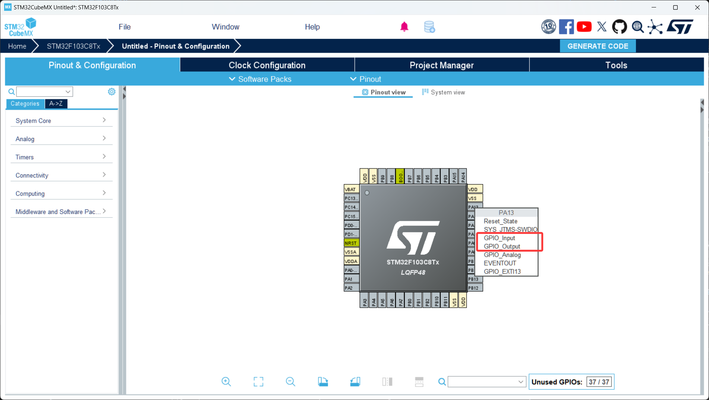
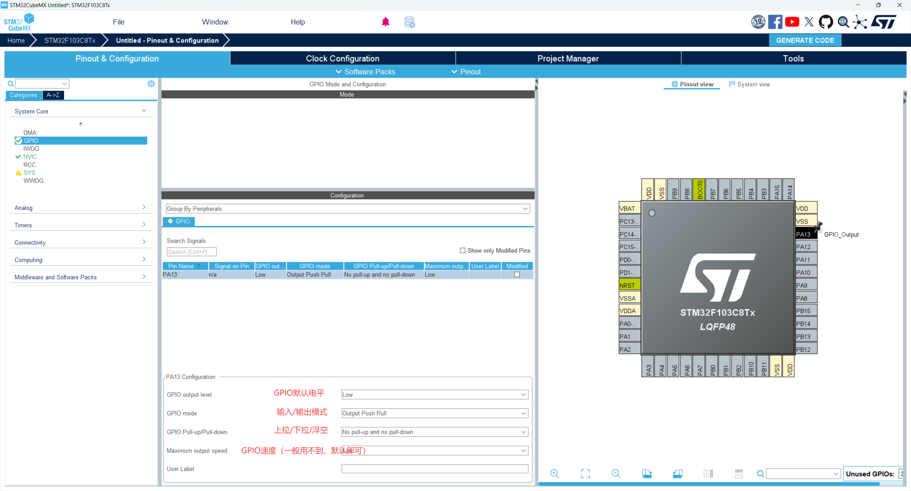
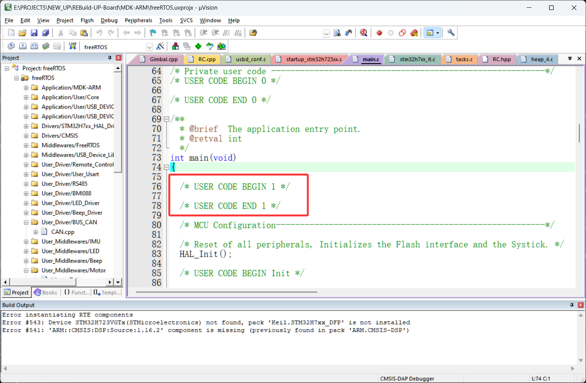

# 第 1 节 · 嵌入式的 Hello World：点亮一只 LED

> 本节目标：完成你的第一个最小 STM32 程序，学会配置时钟树以及GPIO，让板载 LED 按预期亮灭。

> 从本节开始，如有对应的推荐教程，将在上方出现跳转按钮，可以按需选择观看

## 了解GPIO是什么

GPIO（General Purpose Input Output，通用输入输出）是一种通用的数字输入/输出端口。在嵌入式系统中，GPIO被设计为灵活的引脚，可以被配置为输入或输出，以满足不同的应用需求。

通俗的来讲，单片机上任意一个可以被配置的引脚都被称为GPIO。

### GPIO输出模式：

GPIO的输出模式分为两种，开漏输出（OpenDrain）和推挽输出（PushPull），其中的区别请参照这个[视频](https://www.bilibili.com/video/BV1Pr4y1n74J/?spm_id_from=333.337.search-card.all.click&vd_source=f79c4fb3a87fdbf0344788af617382f9)，在这里不过多介绍

当GPIO处于输出模式时，其电压状态有两种，高电压（3.3V俗称高电平），低电压（0V俗称低电平）那么在这里有个问题，既然GPIO能够输出高电平，那我直接拿单片机驱动电机可以不可以？

答案是不行，因为单片机的IO口内阻很大，只能驱动功率很小的用电器，比如1-3只LED、与其他芯片通信等，所以单片机的GPIO大多数情况下都作通信接口使用，也就是只向外传递信息，不直接驱动用电器。

### GPIO的输入模式:

GPIO的输入模式分为四种：模拟输入、浮空输入、上拉输入（Pull Up）、下拉输入（Pull Down）

模拟输入：把单片机的引脚当成adc使用，这部分内容我们用不到所以不过多讲解

上拉输入：顾名思义，单片机的引脚被内部的电源上拉到3.3V，即没有外部干扰，单片机引脚将始终处于3.3V，这种模式一般选择将按键接在引脚与地之间来捕获输入信号

下拉输入：顾名思义，单片机的引脚被内部的电源下拉到0V，即没有外部干扰，单片机引脚将始终处于0V，这种模式一般选择将按键接在引脚与3.3V之间来捕获输入信号

浮空输入：单片机引脚处于高阻状态，本身不被上拉或下拉，这种模式一般配合外部的上拉或下拉使用

## 如何配置GPIO的输入/输出

1. 打开CubeMX工程，单机你连接LED灯的引脚，在出现的选项框里选择GPIO_Input（输入）/GPIO_Output（输出）
2. 在左侧GPIO设置界面，配置你想要的输入/输出方式，参考图片
3. 输出引脚配置成推挽输出，上拉模式，输入的引脚配置成上拉输入或下拉输入（取决于你按键的连接方式）

## 关键代码

1. 配置好后用CubeMX生成代码
2. 打开Keil工程，注意：工程中你自己写的代码请务必存放在一对Begin/End之间，如图所示
3. 关键代码
```c
HAL_GPIO_WritePin(GPIOA, GPIO_PIN_13， GPIO_PIN_SET);//设置GPIO输出状态：高电平/低电平
//GPIOA：GPIO组 ABCDE...
//GPIO_PIN_13：GPIO引脚
//GPIO_PIN_SET/GPIO_PIN_RESET：高/低电平

HAL_GPIO_ReadPin(GPIOA, GPIO_PIN_13);//读取GPIO引脚电平，高电平返回GPIO_PIN_SET，低电平返回GPIO_PIN_RESET
```

## 

## 本章任务

用你手里的小蓝板以及LED灯实现：

1. 让LED灯不断亮灭，频率自定义
2. 用按键输入控制LED灯的亮灭，实现按一下灯亮，再按一下灯灭