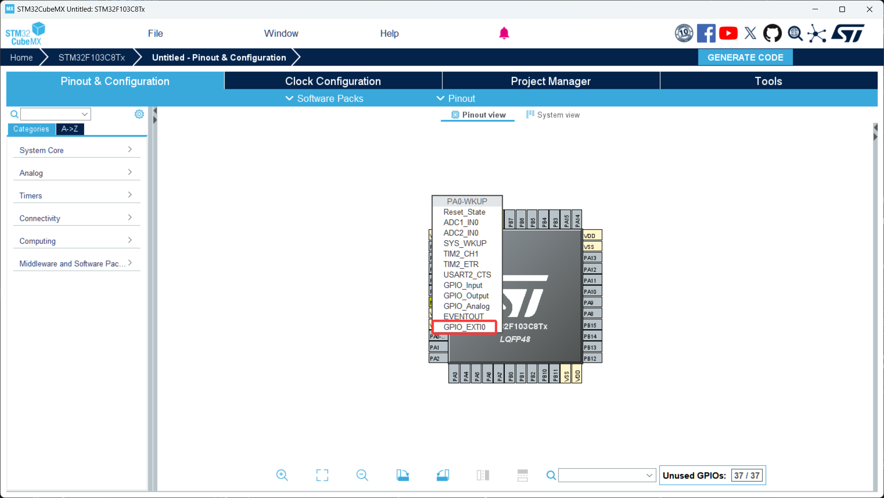
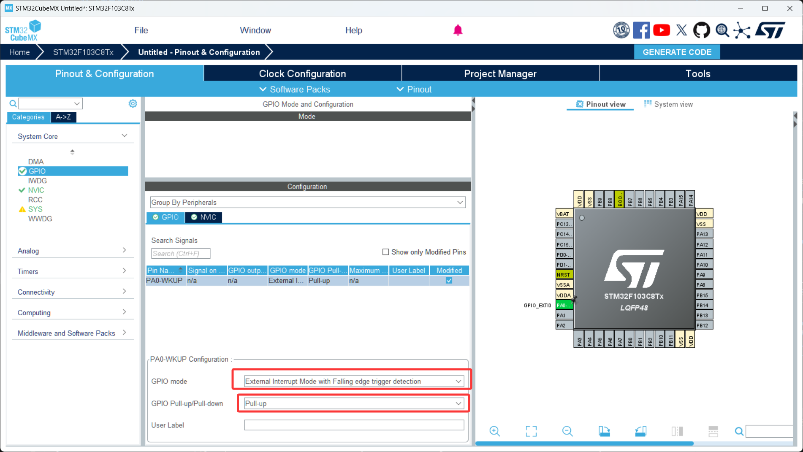
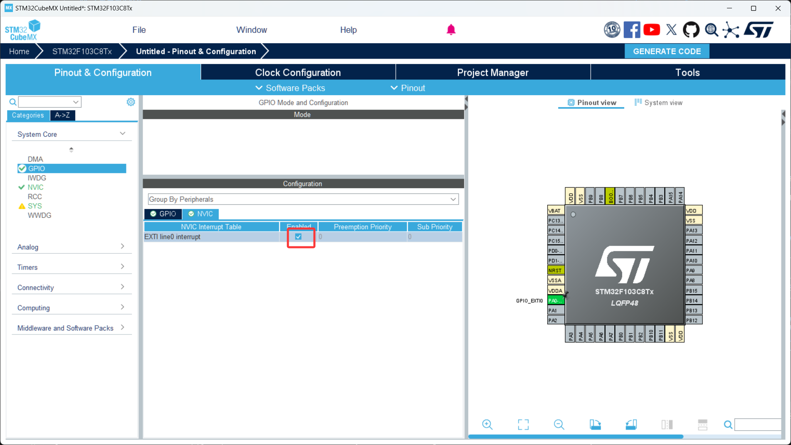

# 第 2 节 · 让程序自己响应：了解中断

> 本节目标：理解"事件驱动"的编程思想，掌握外部中断（EXTI）的配置方法，能够用按键触发中断来控制 LED 状态翻转。

> 如有对应的推荐教程，将在上方出现跳转按钮，可以按需选择观看

## 了解中断是什么

中断（Interrupt）是单片机响应外部或内部事件的一种机制。可以这样理解：CPU 本来在 `while(1)` 里执行自己的任务，当某个事件（按键按下、定时器溢出、串口收到数据等）发生时，CPU 会暂停当前工作，跳去执行对应的"处理函数"，处理完再回到原来的位置继续执行。

通俗地说，中断就是让 CPU 从"主动一遍遍去问有没有事"变成"事情来了我再处理"。

那么这里有个问题，既然我可以在 `while(1)` 里不断检测引脚状态来判断按键有没有按下，那我为什么还要用中断？

答案是效率太低。轮询（一直主动检测）会让 CPU 把绝大多数时间都浪费在"还没事呢、还没事呢"这种无意义的检查上，而且一旦你的主循环里还要做别的事情（比如刷新屏幕、跑算法），就很容易错过那一瞬间的按键信号。中断则是事件来了硬件直接打断 CPU，响应快、不漏事件、还能让主循环空出来干正事。

### 外部中断（EXTI）

外部中断是指由单片机外部引脚电平变化触发的中断，也是入门最常接触的一种。STM32 的每一个 GPIO 引脚都可以配置成外部中断输入，但同一个编号的引脚在不同 GPIO 组里只能选一个（比如 PA0 和 PB0 不能同时作为 EXTI0 中断源，只能二选一）。

### 中断的触发方式

外部中断有三种触发方式：

上升沿触发（Rising Edge）：引脚电平从低变高的瞬间触发一次中断，常用于按键接到地、平时上拉为高、按下变低再松开变高的场景。

下降沿触发（Falling Edge）：引脚电平从高变低的瞬间触发一次中断，最常见的按键场景就是这种 —— 引脚平时被上拉到 3.3V，按键按下时把引脚拉到地，产生一次下降沿。

双边沿触发（Rising/Falling Edge）：上升沿和下降沿都会触发中断，常用于编码器、需要同时识别按下和松开的旋钮等场景。

### NVIC 是什么

NVIC（Nested Vectored Interrupt Controller，嵌套向量中断控制器）是 STM32 用来管理所有中断的硬件模块。它的作用一句话概括：决定哪些中断能被响应、以及多个中断同时来了时谁先谁后。

入门阶段你只需要知道：要让一个中断真正生效，除了配置引脚为中断模式之外，还必须在 NVIC 里把对应的中断"使能"打开，否则信号到了 CPU 也会装作没看见。

## 如何配置外部中断

1. 打开 CubeMX 工程，单击你连接按键的引脚，在弹出的选项框里选择 `GPIO_EXTIx`（x 是引脚编号，比如 PA0 就是 `GPIO_EXTI0`）
2. 在左侧 GPIO 设置界面，把这个引脚的触发方式设置为 `External Interrupt Mode with Falling edge trigger detection`（下降沿触发），上下拉模式选择 `Pull-up`（上拉）
3. 切换到 NVIC 设置界面，勾选对应的 `EXTIx` 中断使能（比如 PA0 对应的就是 `EXTI line0 interrupt`）

## 关键代码

1. 配置好后用 CubeMX 生成代码
2. 打开 Keil 工程，注意：你自己写的回调函数代码同样要放在 Begin/End 注释对之间
3. 关键代码

```c
// 中断回调函数：当外部中断触发时，HAL 库会自动调用这个函数，这个函数在HAL库中是有weak定义的，感兴趣可以自己搜索下
// 这个函数需要你自己在 .c 文件里写出来，名字和参数必须完全一致
void HAL_GPIO_EXTI_Callback(uint16_t GPIO_Pin)
{
  // GPIO_Pin：触发本次中断的引脚编号
  // 一个回调函数会处理所有 EXTI 中断，所以必须先判断到底是哪个引脚触发的
  if (GPIO_Pin == GPIO_PIN_0)
  {
    HAL_GPIO_TogglePin(GPIOC, GPIO_PIN_13);
    // HAL_GPIO_TogglePin：翻转指定引脚的电平状态
    // 高电平 -> 低电平，低电平 -> 高电平
  }
}
```

## 中断编程的两个铁律

### 中断服务函数必须短

在中断里**绝对不要**做耗时操作，更不要写 `HAL_Delay()`。原因是：CPU 在处理中断的时候，主循环是被冻住的，如果你的中断函数跑了 500ms，那这 500ms 内别的中断也响应不了、主循环也不动。

中断函数的标准职责只有三件事：快速响应、置个标志位、通知主循环。复杂的处理逻辑（比如刷屏、打印日志、控制电机）请放回 `while(1)` 里去做。

### 按键抖动是物理现实，不是 bug

机械按键在被按下的那一瞬间，触点会因为弹性多次接触和分离，产生几毫秒的"抖动"。表现就是：你只按了一下，中断却触发了 3 次、5 次、甚至更多。

解决办法有两种：

软件消抖：中断里只置标志位，主循环检测到标志位后延时 10~20ms 再读一次引脚状态，确认确实还是按下状态才认为是一次有效按键。

硬件消抖：在按键两端并联一个 0.1uF 的电容，把抖动的高频毛刺直接滤掉。

## 排查思路

- 中断完全不进：先检查引脚是否配成了 EXTI 模式、触发边沿是否正确、NVIC 里对应的中断是否使能。
- 进了中断但现象不对：检查回调函数里 `if (GPIO_Pin == ...)` 判断的引脚号对不对。
- 一次按键触发多次：基本就是抖动，加消抖即可。

## 本章任务

用你手里的小蓝板、按键和 LED 灯实现：

1. 用外部中断检测按键按下事件，每按一次按键，让 LED 翻转一次状态
2. 在 1 的基础上加入软件消抖逻辑，确保按一次只翻转一次
3. （进阶）用两个按键分别触发不同的中断，一个让 LED 亮、一个让 LED 灭
