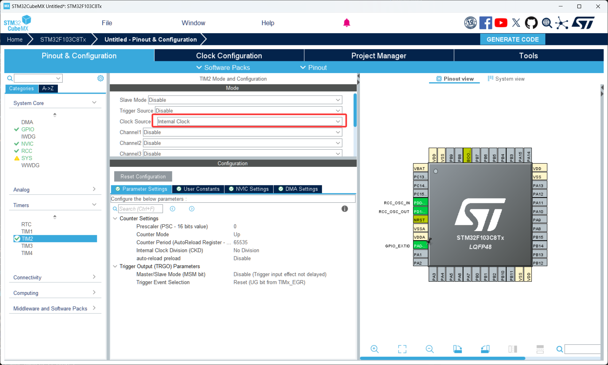
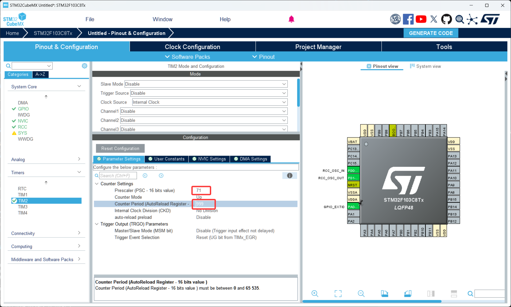
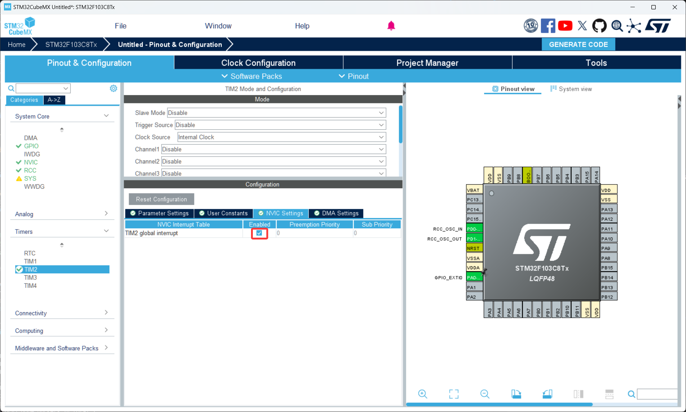

# 第 3 节 · 给时间装上刻度：定时器

> 本节目标：理解 STM32 定时器的计数原理，掌握 PSC 和 ARR 这两个关键参数的含义和计算方法，能够配置一个固定周期的定时中断。

> 如有对应的推荐教程，将在上方出现跳转按钮，可以按需选择观看

## 了解定时器是什么

定时器（Timer）的本质就是一个**会自动按某个频率往上数（或者往下数）的硬件计数器**。它独立于 CPU 工作，CPU 只要一开始把"数到多少触发一次"告诉它，后面它就会一直自己数，到了就喊一声"时间到"（产生中断或事件），CPU 该干嘛干嘛。

通俗地讲，定时器就是芯片内部的一只"硬件秒表"，比软件 `for` 循环延时精准得多，也不会占用 CPU。

那么这里有个问题，既然我可以用 `HAL_Delay(1000)` 等 1 秒，那我为什么还要费劲配置定时器？

答案是 `HAL_Delay` 是阻塞式的——CPU 在那 1 秒里什么都干不了，主循环里别的任务全部停摆。而定时器是硬件级的，CPU 该干嘛干嘛，时间一到再被中断打断进来处理一下，效率高得多。任何稍微正经一点的项目，都是用定时器做时间基准，而不是 `HAL_Delay`。

### STM32F103 的三类定时器

F103 上的定时器分成三类：

基本定时器（TIM6、TIM7）：只能计数和触发更新中断，没有输入捕获、没有 PWM 输出。一般用来给 DAC 提供时钟基准，入门阶段几乎用不到。

通用定时器（TIM2、TIM3、TIM4、TIM5）：功能最常用的一类，能做定时中断、PWM 输出、输入捕获、编码器接口。**入门首选 TIM2 或 TIM3**。

高级定时器（TIM1、TIM8）：在通用定时器基础上加了互补输出、死区控制、刹车输入等功能，主要用于驱动三相电机和电源拓扑。前期不需要碰。

### 三个核心参数：PSC、ARR、CNT

理解定时器只需要搞懂这三个寄存器：

PSC（Prescaler，预分频器）：把定时器的输入时钟分频，得到一个更慢的计数频率。

ARR（Auto Reload Register，自动重装载值）：计数器数到这个值时溢出，产生更新事件。

CNT（Counter，计数器）：当前计数到了多少。从 0 开始，到 ARR 后清零重新开始。

### 频率计算公式

**这是本节最重要的内容，请务必记住**：

```
计数频率 = 定时器时钟 / (PSC + 1)
更新频率 = 计数频率 / (ARR + 1)
中断周期 = 1 / 更新频率
```

举个例子：F103 的通用定时器时钟通常是 72MHz，我们想让它每 1ms 中断一次：

- 想让中断周期是 1ms，即更新频率 = 1000Hz
- 设 PSC = 7199，则计数频率 = 72MHz / (7199+1) = 10000Hz = 10kHz
- 设 ARR = 9，则更新频率 = 10000 / (9+1) = 1000Hz ✓

注意这里 **PSC 和 ARR 都要 +1**，是 STM32 的硬件设计。CubeMX 里填的就是寄存器原值，不要自己手动减 1。

## 如何配置定时器中断

1. 打开 CubeMX 工程，在左侧 `Timers` 里展开你想用的定时器（这里以 `TIM2` 为例），把 `Clock Source` 设置为 `Internal Clock`
2. 在中间的参数面板，根据上面的公式填入 `Prescaler` 和 `Counter Period (ARR)` 两个值
3. 切换到 `NVIC Settings` 选项卡，勾选 `TIM2 global interrupt`

## 关键代码

1. 配置好后用 CubeMX 生成代码
2. 打开 Keil 工程，注意：定时器**不会自己启动**，必须在 `main` 函数里手动开启
3. 关键代码

```c
// 启动定时器并使能更新中断
// 必须写在主循环之前，否则中断永远不会触发
HAL_TIM_Base_Start_IT(&htim2);
// &htim2：定时器句柄，CubeMX 会自动定义在 main.c
// 函数名后缀 _IT 表示以中断方式启动；不加 _IT 就只启动定时器但不开中断


// 定时器更新中断回调函数：每次定时器溢出时被自动调用
// 函数名固定，参数固定，写在 main.c 的 USER CODE 区域即可
void HAL_TIM_PeriodElapsedCallback(TIM_HandleTypeDef *htim)
{
  // 多个定时器都会进这个回调，必须先判断是哪个定时器触发的
  if (htim->Instance == TIM2)
  {
    tick_1ms++;  // 每 1ms 自增一次
  }
}
```

## 用定时器做"软件时基"

最经典的入门用法是：用一个 1ms 中断维护一个全局计数变量，主循环里靠这个变量做延时和调度。这种方式既精准又不阻塞主循环。

```c
volatile uint32_t tick_1ms = 0;

// 主循环里要做"每 500ms 翻转 LED"
static uint32_t last_toggle = 0;
if (tick_1ms - last_toggle >= 500)
{
  last_toggle = tick_1ms;
  HAL_GPIO_TogglePin(GPIOC, GPIO_PIN_13);
}
```

这种写法的好处是：主循环可以同时维护好几个不同周期的任务，互不阻塞。比 `HAL_Delay(500)` 高级得多。

注意 `tick_1ms` 变量必须加 `volatile` 修饰，告诉编译器这个变量会在中断里被改，不要给优化掉。

## 初学者常见误区

PSC 和 ARR 计算错误：忘了 +1，或者把定时器时钟当成了系统时钟。F103 上 APB1 的定时器（TIM2/3/4）时钟是 72MHz，不是 36MHz——因为有倍频机制。

只调用 `HAL_TIM_Base_Start` 不调用 `HAL_TIM_Base_Start_IT`：前者只启动计数不开中断，回调永远不进。

中断里做太多事：定时器中断要保持极短，复杂逻辑放主循环里跑。否则中断周期就抖动了，时基不再精准。

## 本章任务

用你手里的小蓝板实现：

1. 配置 TIM2 每 1ms 中断一次，在中断里维护一个 `tick_1ms` 全局变量
2. 在主循环里基于 `tick_1ms` 实现"每 500ms 翻转一次板载 LED"，禁止使用 `HAL_Delay`
3. （进阶）同时做两件事：LED 每 500ms 翻转，另外每 100ms 让另一个 GPIO 输出一个 50ms 的脉冲。验证两个任务互不影响
