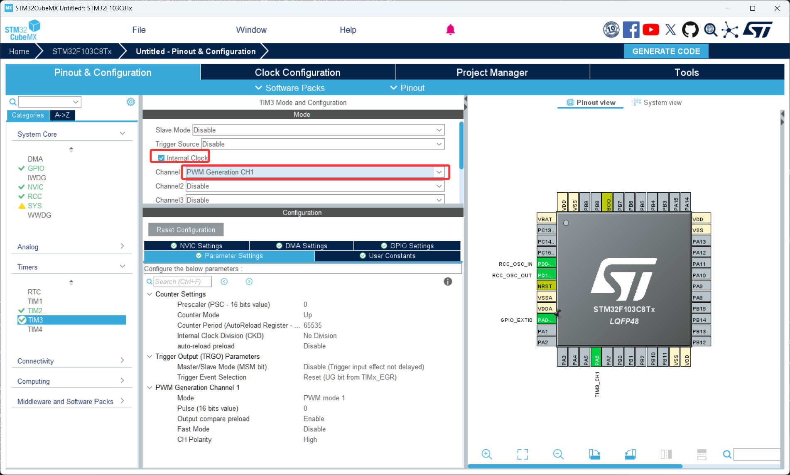
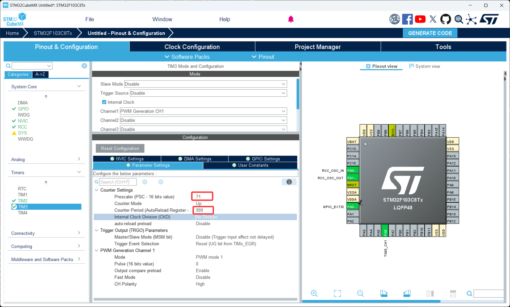
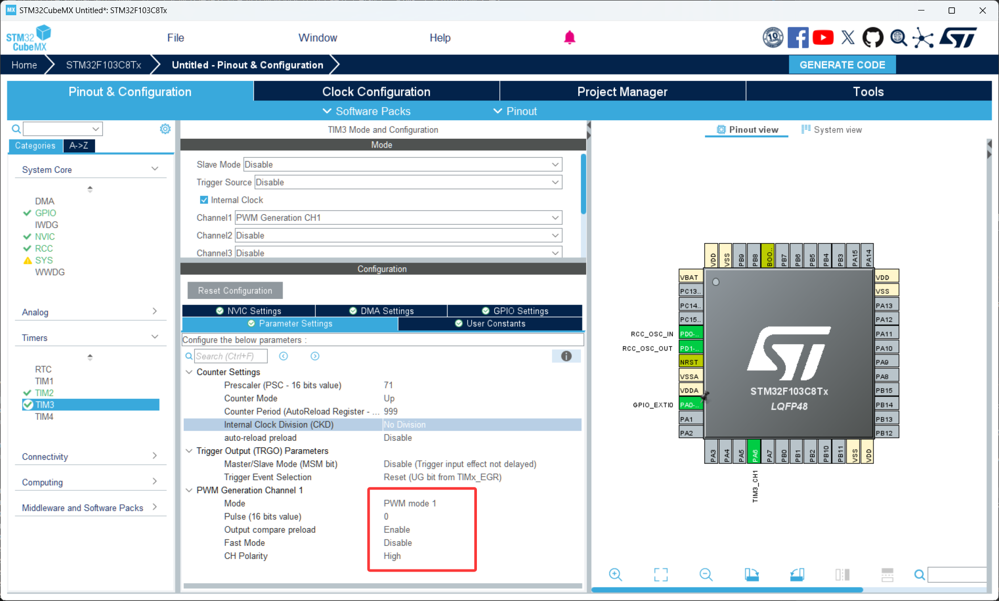

# 第 4 节 · 用占空比控制能量：PWM

> 本节目标：理解 PWM 的频率和占空比这两个概念，能够基于通用定时器输出一个占空比可调的方波，做一个会渐亮渐灭的呼吸灯。

> 如有对应的推荐教程，将在上方出现跳转按钮，可以按需选择观看

## 了解 PWM 是什么

PWM（Pulse Width Modulation，脉冲宽度调制）是一种在固定周期内、通过改变高电平所占时间比例来等效控制输出能量的技术。它产生的波形长这样：

```
    高 ___        ___        ___
       |  |      |  |      |  |
    低 |  |______|  |______|  |______
       <-周期->
       <高>
```

通俗地讲，PWM 就是让 IO 口快速地"开-关-开-关"，开的时间多，平均功率就高；开的时间少，平均功率就低。

那么这里有个问题，既然要降低功率，我直接给芯片输出一个 1.5V 不就行了吗？

答案是不行，因为单片机的 GPIO 是数字输出，只能给 0V 或 3.3V，给不了中间电压（除非用 DAC）。但通过快速切换高低电平，让人眼或电机来不及反应中间过程，只能感受到"平均效果"——这就是 PWM 的核心思想。LED 调光、电机调速、舵机控制几乎全部基于这个原理。

### 频率与占空比

PWM 只有两个核心参数：

频率（Frequency）：一秒钟重复多少个周期。LED 调光建议 1kHz 以上避免肉眼可见的闪烁，舵机标准是 50Hz，电机驱动通常 10kHz~20kHz。

占空比（Duty Cycle）：一个周期内高电平所占的百分比。50% 占空比 = 一半时间高、一半时间低。占空比 0% 就是一直低，100% 就是一直高。

关系：
```
占空比 = 高电平时间 / 周期 = CCR / (ARR + 1)
```

### PWM 模式 1 vs 模式 2

CubeMX 里配置 PWM 时会让你选 PWM mode 1 或 PWM mode 2，区别只是高低电平的逻辑反过来：

PWM mode 1：CNT < CCR 时输出高电平，否则低电平。**最常用，CCR 越大越亮**。

PWM mode 2：CNT < CCR 时输出低电平，否则高电平。CCR 越大越暗。

入门一律用 mode 1。

### 引脚和定时器通道的对应关系

并不是任意引脚都能输出 PWM。每一个定时器通道在芯片设计时就固定连到了某几个引脚上。F103 上常用的对应关系：

| 定时器 | 通道 1 | 通道 2 | 通道 3 | 通道 4 |
| --- | --- | --- | --- | --- |
| TIM2 | PA0 | PA1 | PA2 | PA3 |
| TIM3 | PA6 | PA7 | PB0 | PB1 |
| TIM4 | PB6 | PB7 | PB8 | PB9 |

CubeMX 里点引脚选择 `TIMx_CHy` 即可，记不住没关系，CubeMX 会用绿色高亮告诉你哪些引脚能用。

## 如何配置 PWM 输出

1. 打开 CubeMX 工程，在左侧 `Timers` 里展开你想用的定时器（这里以 TIM3 为例），把 `Clock Source` 设置为 `Internal Clock`，把对应通道（比如 `Channel1`）设置为 `PWM Generation CH1`
2. 在中间的参数面板，按上一节定时器的公式填入 `Prescaler` 和 `Counter Period (ARR)`，决定 PWM 频率。比如 PSC=71、ARR=999，PWM 频率就是 72MHz/(71+1)/(999+1) = 1kHz
3. 在 `PWM Generation Channel1` 里，`Mode` 选 `PWM mode 1`，`Pulse` 是初始 CCR 值（决定开机后的初始占空比），`Polarity` 选 `High`

## 关键代码

1. 配置好后用 CubeMX 生成代码
2. 打开 Keil 工程，PWM 同样**不会自己启动**，必须手动调用启动函数
3. 关键代码

```c
// 启动 PWM 输出，写在 while(1) 之前
HAL_TIM_PWM_Start(&htim3, TIM_CHANNEL_1);
// &htim3：定时器句柄
// TIM_CHANNEL_1：要启动的通道编号，对应你 CubeMX 里配的那个通道


// 动态修改占空比：改 CCR 即可
__HAL_TIM_SET_COMPARE(&htim3, TIM_CHANNEL_1, 500);
// 第三个参数是 CCR 值，范围 [0, ARR]
// 假设 ARR=999，传 500 = 占空比 50%；传 999 = 100%；传 0 = 0%
```

## 实现一个呼吸灯

把 LED 接到 PWM 引脚（注意 PC13 上的板载 LED 不是 PWM 通道，需要外接一只 LED 到 PA6 之类的 PWM 引脚），主循环里让 CCR 从 0 慢慢加到 ARR、再慢慢减回 0，看到的就是 LED 渐亮渐灭的呼吸效果：

```c
uint16_t duty = 0;
int8_t step = 1;

while (1)
{
  __HAL_TIM_SET_COMPARE(&htim3, TIM_CHANNEL_1, duty);
  duty += step;
  if (duty >= 1000) step = -1;
  if (duty == 0)    step =  1;
  HAL_Delay(2);  // 控制呼吸速度
}
```

## 常见问题排查

| 现象 | 原因 |
| --- | --- |
| 引脚完全没有波形 | 引脚没配成 PWM 复用，或者忘了调 `HAL_TIM_PWM_Start` |
| LED 一直全亮或全灭 | CCR 设成了 0 或 ≥ ARR+1，或者 mode 选反了 |
| LED 明显闪烁 | PWM 频率太低（<100Hz），人眼能分辨 |
| 占空比不变 | 调用了 `__HAL_TIM_SET_COMPARE` 但通道号写错 |

## 本章任务

用你手里的小蓝板实现：

1. 配置 TIM3 通道 1（PA6）输出 1kHz 的 PWM，把 LED 通过 220Ω 电阻接到 PA6 和 GND 之间，做一个呼吸灯
2. 改变 PWM 频率到 50Hz，肉眼观察 LED 闪烁现象，体会"频率太低"是什么效果
3. （进阶）同时配 TIM3 的两个通道（PA6、PA7），分别接两只不同颜色的 LED，让它们以不同的相位呼吸
