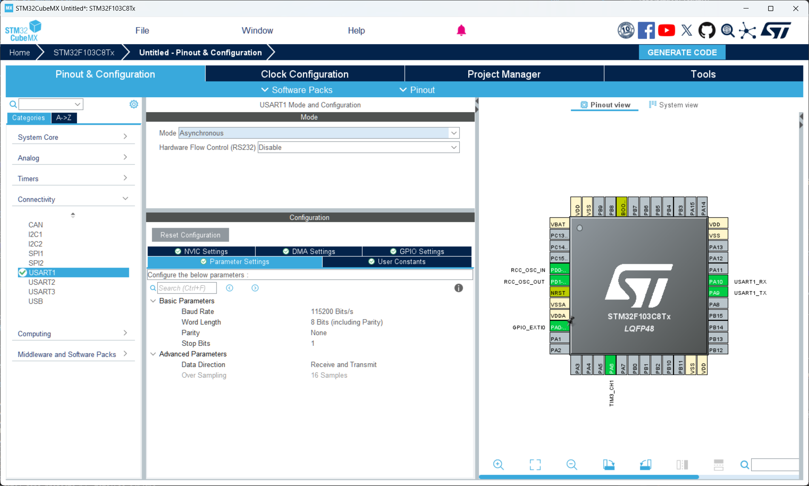
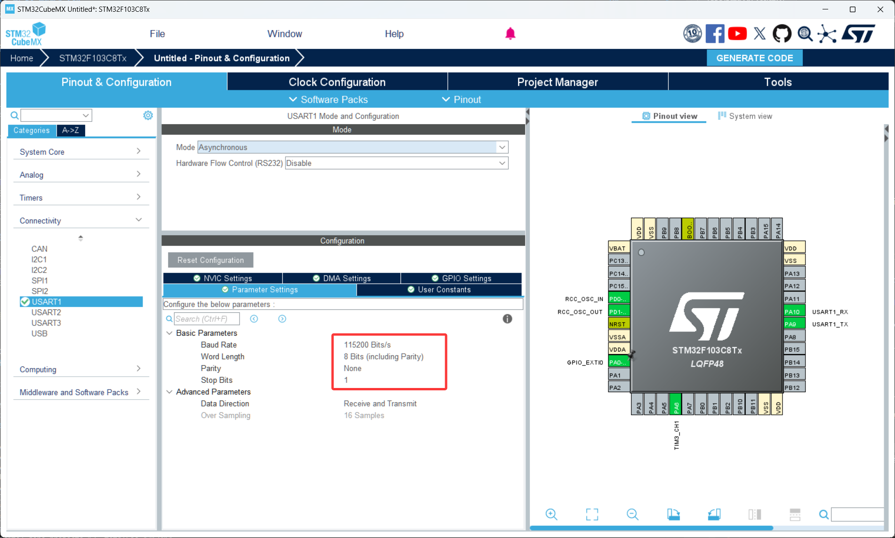
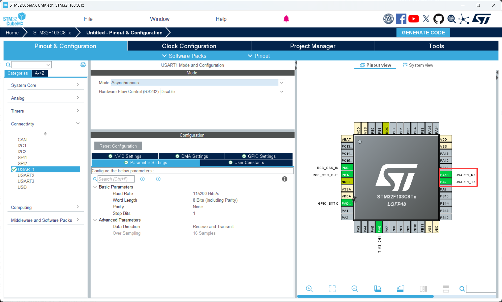

# 第 5 节 · 让芯片开口说话：串口

> 本节目标：理解串口（UART）的通信原理，掌握波特率、数据位、停止位这几个关键参数，完成最基础的"STM32 -> 电脑"和"电脑 -> STM32"双向收发。

> 如有对应的推荐教程，将在上方出现跳转按钮，可以按需选择观看

## 了解串口是什么

串口（UART，Universal Asynchronous Receiver/Transmitter，通用异步收发器）是嵌入式里最常见、最简单、也最经典的一种通信方式。它只用两根信号线就能完成全双工通信，被广泛用于：

- 调试输出（把变量打印到电脑串口助手上看）
- 模块间通信（蓝牙模块、GPS 模块、4G 模块都用串口和单片机对话）
- 上位机控制（电脑发命令控制单片机执行动作）

通俗地讲，串口就是**两个设备之间约定一个频率，按这个频率一位一位地把数据发过去**。

那么这里有个问题，既然我可以用 SPI、I2C 这些更高级的总线，为什么大家调试还是首选串口？

答案是因为串口足够简单——两根线、一个电平、一个时间约定就能跑通，几乎不需要驱动。任何模块、任何芯片都能用串口通信。**学嵌入式开发时，让串口能正常打印日志几乎是排错的第一步**，这一步打通了，后面的开发会顺畅得多。

### 异步通信 vs 同步通信

UART 名字里的"A"代表 Asynchronous（异步），意思是**收发双方不共享时钟线**。两边各自维护自己的时钟，靠提前约定好的"波特率"来同步采样。

异步通信：UART、RS232、RS485。优点：线少（两根）。缺点：双方时钟必须足够准。

同步通信：SPI、I2C。优点：通信稳定、速度高。缺点：需要额外的时钟线。

### 关键参数

入门要记住的串口参数有四个：

波特率（Baud Rate）：每秒传输多少位。常用值：9600、115200、460800。**收发双方必须设成完全一致的值，不一样就会全是乱码**。

数据位（Data Bits）：一次传几位有效数据。99% 的情况都是 8 位（也就是 1 字节）。

停止位（Stop Bits）：一帧数据后停几个位。最常见是 1 位。

校验位（Parity）：奇偶校验，用来粗略检测传输错误。最常见是 None（无校验），写代码用不到。

合在一起的简写就是 `115200 8N1`：波特率 115200、8 数据位、无校验、1 停止位。这是嵌入式默认配置，后面你会反复看到。

### TX 和 RX 必须交叉接

串口的两根信号线分别是：

- TX（Transmit）：发送数据
- RX（Receive）：接收数据

接线必须**交叉**：

```
STM32 TX  ----->  USB-TTL RX
STM32 RX  <-----  USB-TTL TX
STM32 GND ------  USB-TTL GND
```

A 设备的 TX 接 B 设备的 RX，A 设备的 RX 接 B 设备的 TX，**而且必须共地**。这是初学最常踩的坑——TX 接 TX、RX 接 RX 接成一样的，结果一点反应都没有。

### USB 转 TTL

电脑上没有 STM32 能直接用的串口，所以要买一个"USB 转 TTL"模块（CH340、CP2102、FT232 都行，几块钱一个），它的作用是：电脑端通过 USB 当成 COM 口，硬件端输出 3.3V/5V 的 TTL 电平直接接 STM32。

记得选 3.3V 模式（小蓝板是 3.3V 逻辑），或者用支持电平自适应的模块。**5V TTL 直接接 STM32 RX 长期使用有烧引脚的风险**。

## 如何配置串口

1. 打开 CubeMX 工程，在左侧 `Connectivity` 里点开 `USART1`，把 `Mode` 设置为 `Asynchronous`
2. 在中间的 `Parameter Settings` 里，配置 `Baud Rate=115200`、`Word Length=8 Bits`、`Parity=None`、`Stop Bits=1`，其他保持默认
3. 此时 PA9 和 PA10 会自动被配置为 USART1_TX 和 USART1_RX，引脚图上会变成绿色（此时按CTRL再托拖动USART引脚可以选择其他可用的引脚哦）

## 关键代码

1. 配置好后用 CubeMX 生成代码
2. 打开 Keil 工程，串口的发送和接收都有阻塞、中断、DMA 三种方式。本节先讲最简单的阻塞方式，中断和 DMA 是接下来两节的内容
3. 关键代码

```c
// 阻塞式发送：CPU 一直等到所有字节都发完才返回
uint8_t msg[] = "Hello STM32\r\n";
HAL_UART_Transmit(&huart1, msg, sizeof(msg) - 1, 100);
// &huart1：串口句柄
// msg：要发送的数据缓冲区
// sizeof(msg) - 1：发送长度。-1 是因为字符串末尾有 '\0' 不需要发
// 100：超时时间，单位 ms。一般给 100 就够


// 阻塞式接收：CPU 一直等到收满指定字节数或超时才返回
uint8_t rx_byte = 0;
HAL_StatusTypeDef status = HAL_UART_Receive(&huart1, &rx_byte, 1, 1000);
// 第三个参数：要接收多少字节
// 第四个参数：超时时间。1000ms 内收不到就返回 HAL_TIMEOUT
```

## 常见问题排查

| 现象 | 排查方向 |
| --- | --- |
| 串口助手全是乱码 | 波特率不一致；HSE 没用、内部 RC 时钟不准 |
| 一点反应都没有 | TX/RX 接反；没共地；上位机串口号选错；CubeMX 里串口没使能 |
| 只能发不能收 | RX 引脚没配；上位机发送时缺换行符（很多协议要 `\r\n` 才结尾） |
| `printf` 没输出 | Keil 没勾 `Use MicroLIB`；忘了重定向 `fputc` |

## 本章任务

用你手里的小蓝板和一个 USB-TTL 模块实现：

1. 上电后通过 USART1 自动发送一行 `"STM32 Hub Online\r\n"` 到电脑，串口助手能看到
2. （进阶）实现最简单的 echo：电脑发什么字符过来，板子原样回发
