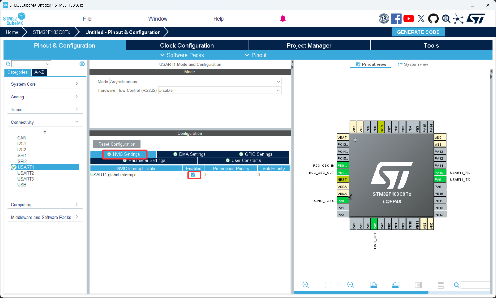
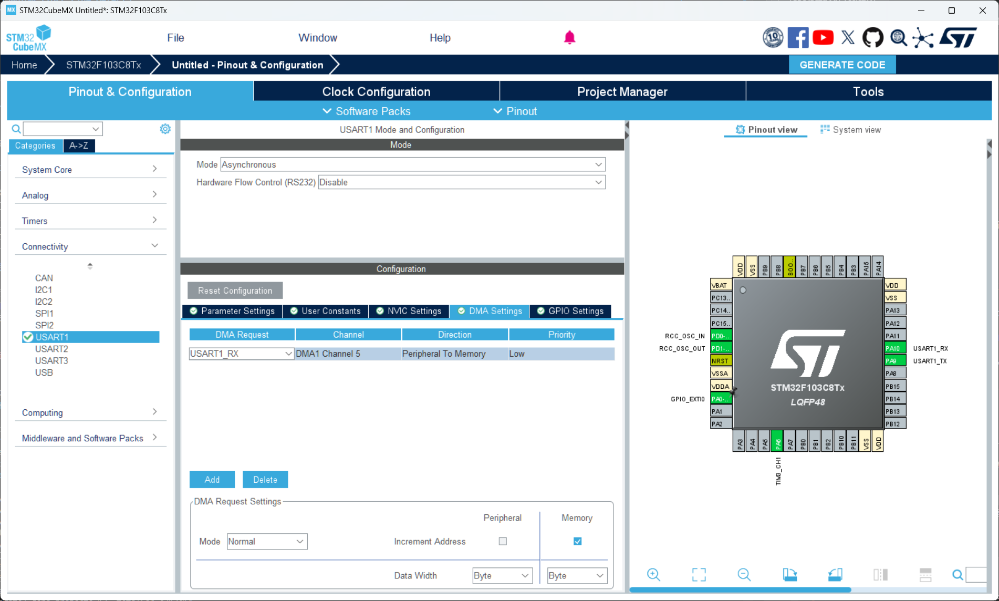
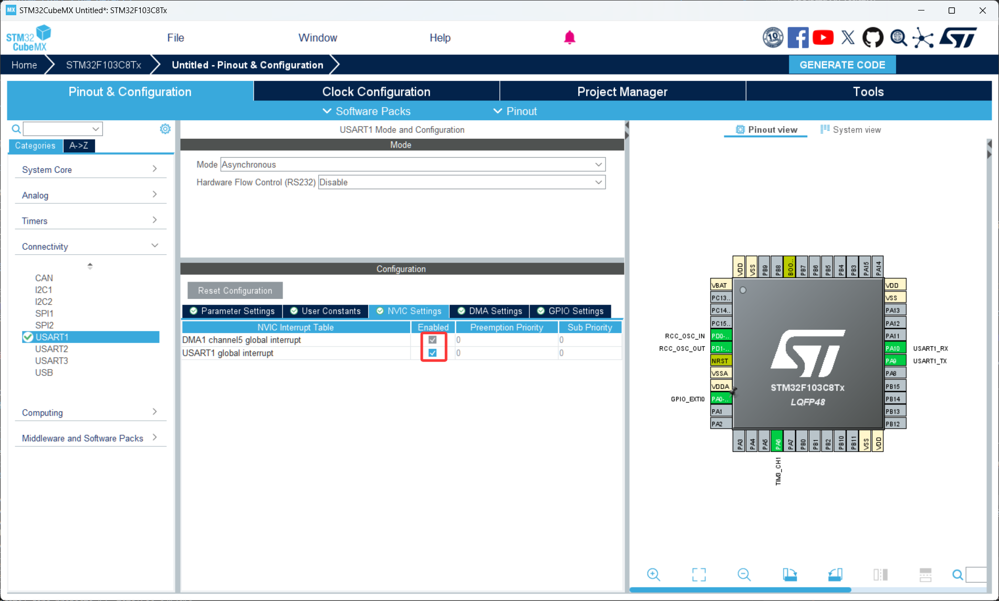

# 第 7 节 · 把搬运交给硬件：串口 DMA（不定长接收）

> 本节目标：理解 DMA 的工作原理，掌握"DMA + 空闲中断"实现不定长接收的标准套路，能够稳定处理上位机发来的任意长度的数据帧。

> 如有对应的推荐教程，将在上方出现跳转按钮，可以按需选择观看

## 了解 DMA 是什么

DMA（Direct Memory Access，直接存储器访问）是 STM32 内部一个专门负责"搬数据"的硬件模块。它的作用一句话：**让外设（比如 UART）和内存之间的数据传输完全绕过 CPU**。

通俗地讲，CPU 的工作是"动脑子做计算"，搬数据是体力活，让 CPU 一个字节一个字节地搬太浪费——不如交给 DMA 这个专职搬运工，CPU 自己去做正事。

那么这里有个问题，前一节我们用中断接收已经能不阻塞 CPU 了，为什么还要用 DMA？

答案是中断只是"事件来了通知 CPU"，CPU 还得进中断里把字节从串口寄存器搬到内存。每收一个字节都要进一次中断，进出中断本身有开销（几微秒）。波特率 115200 一秒要进 1 万多次中断，CPU 会被中断打断得很厉害；上到 460800 或 1Mbps，CPU 基本就跟不上了。**DMA 是硬件直接搬，CPU 完全不参与，只在整批数据搬完后才通知一次**——开销和数据量几乎无关。

### 何时 CPU、何时中断、何时 DMA

| 数据特征 | 推荐方式 |
| --- | --- |
| 单次、确定长度、可以等待 | 阻塞 |
| 字节级命令、协议简单、低速率 | 中断 |
| 数据量大、波特率高、连续流、不定长 | **DMA** |

### DMA 的两种工作模式

DMA 有两种常用模式，CubeMX 里的 `DMA Mode` 选项：

普通模式（Normal）：搬完指定字节数就停，不再搬运。需要再次接收的话，得手动重新启动。适合"一次性接收一帧固定长度的数据"。

循环模式（Circular）：搬完后**自动从缓冲区头部重新开始**，永远不停。适合"持续接收无尽数据流"，比如 GPS、雷达。

实际工程里更常用的不是这两种纯模式，而是它俩和"空闲中断"的组合——见下面。

### 空闲中断（IDLE Line Detect）

UART 硬件能检测**总线空闲**（一段时间内没有任何数据传输）这件事，并产生一个 IDLE 中断。这个特性对接收**不定长**数据帧是杀手级的：

```
对方发来:    [0xA5][0x01][0x02][0xB6]  ........  [0xA5][0x03][0x04][0xB6]
                                       ^         ^
                                       |         |
                                       这段空闲触发 IDLE 中断
```

DMA 一直把数据搬到缓冲区里，**总线一停 IDLE 就触发**，你在 IDLE 回调里就能知道"这一帧到此结束，长度是多少"。这就是处理不定长帧的标准方案。

### HAL 的封装：ReceiveToIdle_DMA

新版 HAL 库（V1.8.0+）直接把"DMA + IDLE"封装成了一个 API：`HAL_UARTEx_ReceiveToIdle_DMA`。它内部已经把 IDLE 中断和 DMA 完成中断都接好了，回调函数会告诉你**本次实际收到了多少字节**。这是目前推荐的写法。

## 如何配置串口 DMA

1. 串口本身的配置和前两节一样（`Asynchronous`、115200 8N1），并使能 `USART1 global interrupt`
2. 切到 `DMA Settings` 选项卡，点击 `Add` 添加一个 `USART1_RX` 的 DMA 通道，`Mode` 选 `Normal`，`Priority` 默认 Low 即可。如果还要发送也可以加 `USART1_TX`
3. 切到 `NVIC Settings`，确认 `USART1 global interrupt` 和 `DMA1 channel5 global interrupt`（USART1_RX 默认走 DMA1 通道 5）都被勾上

## 关键代码

1. 配置好后用 CubeMX 生成代码
2. 打开 Keil 工程，按下面的模式写：在 `main` 里启动 ReceiveToIdle，在回调里处理数据并重新启动
3. 关键代码

```c
#define RX_BUF_SIZE 256
uint8_t rx_buf[RX_BUF_SIZE];  // 全局缓冲区，长度按你的协议上限给


// main 函数里、while(1) 之前，启动 DMA + IDLE 接收
HAL_UARTEx_ReceiveToIdle_DMA(&huart1, rx_buf, RX_BUF_SIZE);
// 接下来不管对方发多少字节，DMA 都会搬到 rx_buf
// 一旦总线空闲，立即触发 RxEventCallback


// 关闭 DMA 半传输中断（可选但强烈建议）
// 默认 HAL 会在缓冲区搬到一半时也触发一次回调，多数情况下会干扰逻辑
__HAL_DMA_DISABLE_IT(huart1.hdmarx, DMA_IT_HT);


// 接收事件回调：IDLE 触发或缓冲区满了都会进
// size 参数告诉你本次实际收到的字节数
void HAL_UARTEx_RxEventCallback(UART_HandleTypeDef *huart, uint16_t size)
{
  if (huart->Instance == USART1)
  {
    // 1) 处理这一帧（rx_buf 的前 size 字节就是本帧）
    process_frame(rx_buf, size);

    // 2) 重新启动接收（同样不能漏）
    HAL_UARTEx_ReceiveToIdle_DMA(&huart1, rx_buf, RX_BUF_SIZE);
    __HAL_DMA_DISABLE_IT(huart1.hdmarx, DMA_IT_HT);
  }
}
```

## 缓冲区大小怎么定

`RX_BUF_SIZE` 至少要**比你协议里最长的一帧大**。比如你的协议最长一帧 200 字节，缓冲区开 256 就够。

如果对方发的数据可能超过缓冲区怎么办？DMA 会把缓冲区填满后触发"传输完成"中断，HAL 也会调用同一个 `RxEventCallback`，size 等于 RX_BUF_SIZE。这时候你已经丢数据了，正确的做法是把缓冲区开大点，或者改协议加分包。

## 不要在回调里做耗时处理

回调里调用 `process_frame` 时如果直接写打印日志、JSON 解析这种重活，下一帧来了你还没处理完。**正确做法是回调里只做"搬数据 + 置标志位"**：

```c
volatile uint8_t frame_ready = 0;
volatile uint16_t frame_len = 0;
uint8_t frame_buf[RX_BUF_SIZE];  // 备份缓冲区

void HAL_UARTEx_RxEventCallback(UART_HandleTypeDef *huart, uint16_t size)
{
  if (huart->Instance == USART1)
  {
    memcpy(frame_buf, rx_buf, size);  // 备份这一帧
    frame_len = size;
    frame_ready = 1;                  // 通知主循环

    HAL_UARTEx_ReceiveToIdle_DMA(&huart1, rx_buf, RX_BUF_SIZE);
    __HAL_DMA_DISABLE_IT(huart1.hdmarx, DMA_IT_HT);
  }
}

// 主循环里
if (frame_ready)
{
  frame_ready = 0;
  process_frame(frame_buf, frame_len);  // 主循环里慢慢解析
}
```

## 常见问题排查

| 现象 | 原因 |
| --- | --- |
| 回调完全不触发 | DMA 通道没加；NVIC 里 USART 或 DMA 中断没使能；旧版 HAL 不支持 ReceiveToIdle |
| 一帧被拆成两次回调 | 半传输中断没关，开 `DMA_IT_HT` 时缓冲区刚好过半就提前触发 |
| 收到一半就停了 | DMA 配成了 Normal 模式但忘了重新启动 |
| 第二帧开始数据错乱 | 回调里没重新启动 ReceiveToIdle |
| 编译报 `HAL_UARTEx_ReceiveToIdle_DMA` 未定义 | HAL 库版本太老，升级或自己用 IDLE 中断 + DMA 拼接 |

## 本章任务

用你手里的小蓝板和 USB-TTL 实现：

1. 用 DMA + IDLE 实现不定长接收：电脑发任意长度的字符串，板子收到后原样发回，并在前面加上 `[len=N]` 显示本帧长度
2. 在 1 的基础上加协议头判断：只有以 `0xA5` 开头的帧才被处理，其他丢弃
