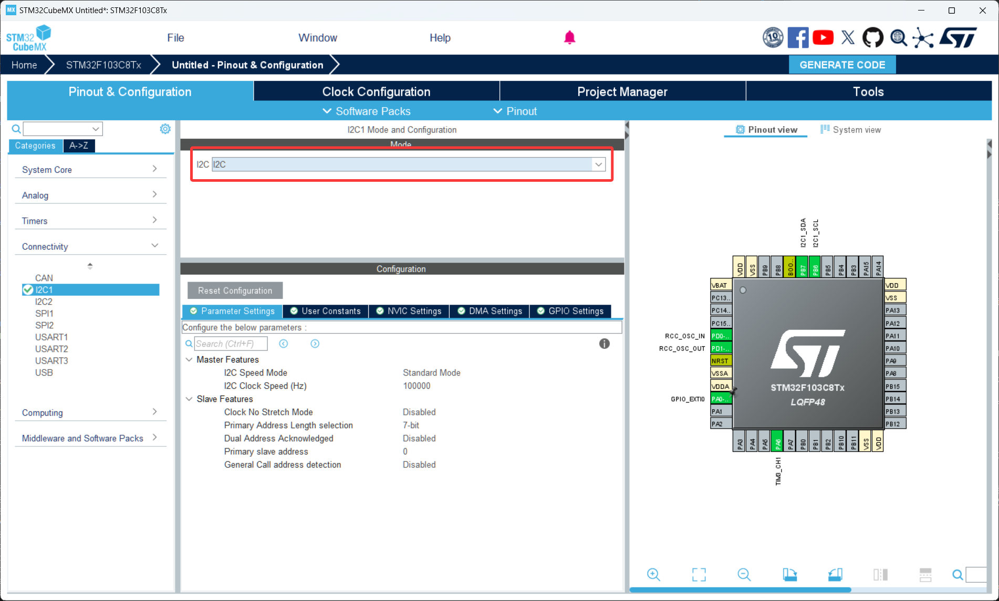
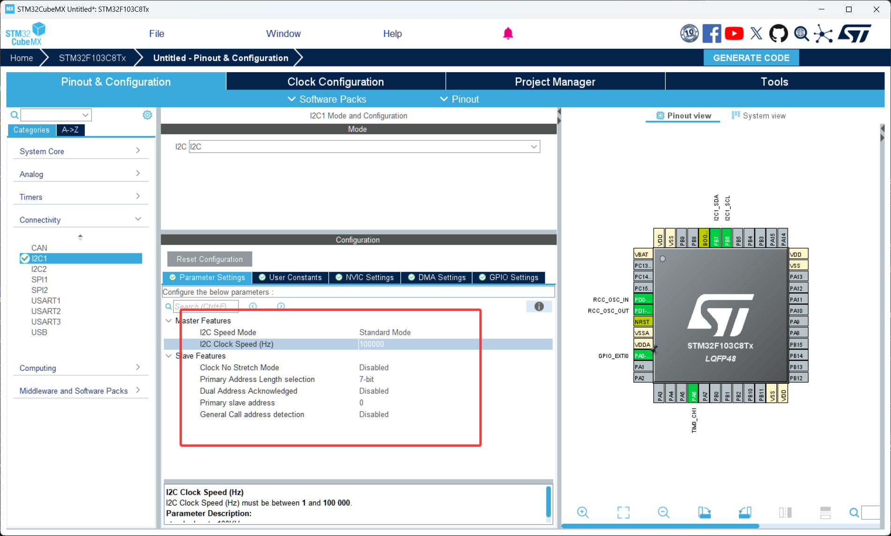

# 第 8 节 · 让外设彼此对话：I2C

> 本节目标：理解 I2C 的两线总线结构和主从通信原理，掌握设备地址、上拉电阻、寄存器读写这几个核心概念，能够用 HAL 库读取一个常见 I2C 器件的寄存器。

> 如有对应的推荐教程，将在上方出现跳转按钮，可以按需选择观看

## 了解 I2C 是什么

I2C（Inter-Integrated Circuit，集成电路间总线）是飞利浦在上世纪八十年代发明的一种**两线制低速通信总线**。它的最大特点是只用两根信号线就能挂多个外设，被广泛用于连接低速配置类器件：

- OLED / LCD 显示屏
- EEPROM 存储芯片
- 传感器（MPU6050 陀螺仪、BMP280 气压计、AHT20 温湿度等）
- RTC 时钟芯片

通俗地讲，I2C 就像一条挂了好几个分机的电话线——所有设备共享同一条线，每个设备有自己的"电话号码"（设备地址），主机想找谁就先报谁的号码，被叫的设备应答以后再开始通信。

那么这里有个问题，上一节我们学了串口（UART），它也是两根线，为什么还要再学 I2C？

答案是 UART 是**点对点**的，一条 UART 只能接一个对端；而 I2C 是**总线**结构，一条线能挂十几个设备，每个还能独立寻址。当你的项目要同时接 OLED + 传感器 + EEPROM 时，I2C 只占两个引脚就全部搞定，UART 要占六七个引脚。

### I2C 的两根线

SCL（Serial Clock Line）：时钟线，由主机产生，决定数据传输节奏

SDA（Serial Data Line）：数据线，双向，用来传实际数据

注意 I2C 是**同步通信**——和 UART 不同，I2C 有专门的时钟线。所以 I2C 的双方不需要事先约定波特率，主机的 SCL 频率多少，从机就跟着多少。

### 主从结构和设备地址

I2C 总线上分两种角色：

主机（Master）：发起通信、产生时钟、决定读写。一般就是 STM32 这边。

从机（Slave）：被动响应主机的请求。每个从机有一个**唯一的 7 位地址**（也有 10 位地址但少见）。

主机想和某个从机通信，第一步就是在总线上喊一声"我要找地址 0x68"，所有从机都听到这个广播，但只有地址匹配的那个会应答。

设备地址通常是芯片厂商在 datasheet 里写好的，也可能由几个引脚的高低电平决定。**注意：HAL 库的 API 里设备地址要左移 1 位**——因为 7 位地址实际是高 7 位、最低位是读写标志。

```c
// MPU6050 的 7 位地址是 0x68
uint8_t dev_addr = 0x68 << 1;  // HAL 用的是 0xD0
```

### 上拉电阻必不可少

I2C 的两根线都是**开漏输出**（OD），意思是芯片只能把线拉低，不能拉高。所以**总线上必须挂上拉电阻**（典型值 4.7kΩ），否则线一直是浮空状态，根本通信不起来。

好消息是大多数 I2C 模块（OLED、MPU6050 等）板子上自带上拉电阻，直接接就能用。但如果你接的是裸芯片，就要自己加。

### 寄存器读写

绝大多数 I2C 器件的工作模式都是"寄存器式"——芯片内部有一堆带编号的小盒子（寄存器），你想读温度就去读"温度寄存器"，想配置量程就去写"配置寄存器"。

读一个寄存器需要两步：

1. 先告诉芯片"我要读 X 号寄存器"（写操作，发寄存器地址）
2. 然后从芯片读回数据（读操作）

HAL 库已经把这两步打包好了，叫 `HAL_I2C_Mem_Read` 和 `HAL_I2C_Mem_Write`，下面会用到。

## 如何配置 I2C

1. 打开 CubeMX 工程，在左侧 `Connectivity` 里点开 `I2C1`，把 `Mode` 设置为 `I2C`
2. 在 `Parameter Settings` 里，`I2C Speed Mode` 一般选 `Standard Mode`（100kHz），调试稳定后再试 `Fast Mode`（400kHz）。其他参数保持默认
3. 此时 PB6 / PB7 会自动被配置为 I2C1_SCL / I2C1_SDA。

## 关键代码

1. 配置好后用 CubeMX 生成代码
2. 打开 Keil 工程，I2C 不需要手动启动，CubeMX 生成的初始化代码已经搞定
3. 关键代码

```c
// 读取一个寄存器（最常用）
uint8_t who_am_i = 0;
HAL_I2C_Mem_Read(&hi2c1, 0x68 << 1, 0x75, I2C_MEMADD_SIZE_8BIT, &who_am_i, 1, 100);
// &hi2c1：I2C 句柄
// 0x68 << 1：从机 7 位地址左移一位 = 0xD0（MPU6050 为例）
// 0x75：寄存器地址（MPU6050 的 WHO_AM_I 寄存器）
// I2C_MEMADD_SIZE_8BIT：寄存器地址长度，常见器件都是 8 位；EEPROM 大容量的可能是 16 位
// &who_am_i：读到的数据放这里
// 1：要读多少字节
// 100：超时 ms


// 写一个寄存器
uint8_t config_val = 0x00;
HAL_I2C_Mem_Write(&hi2c1, 0x68 << 1, 0x6B, I2C_MEMADD_SIZE_8BIT, &config_val, 1, 100);
// 把 0x00 写到 0x6B 寄存器（MPU6050 的 PWR_MGMT_1，写 0 表示唤醒）


// 扫描总线，查看到底接了哪些设备（调试时极其有用）
for (uint8_t addr = 1; addr < 128; addr++)
{
  if (HAL_I2C_IsDeviceReady(&hi2c1, addr << 1, 1, 10) == HAL_OK)
  {
    printf("Found device at 0x%02X\n", addr);
  }
}
```

## 调试 I2C 的标准顺序

I2C 出问题的时候，按这个顺序排查能省一半时间：

1. **硬件层**：确认接线 SCL/SDA 没接反，确认有上拉电阻（万用表量两根线对 GND 不应该是无穷大），确认器件供电（很多模块要 3.3V，5V 会烧）
2. **设备地址**：跑一遍上面的总线扫描，确认能扫到设备。地址扫不到，后面写什么代码都白搭
3. **寄存器地址**：对照 datasheet 确认你读的寄存器号是对的
4. **时序参数**：稳定后再尝试加速。通信速率有问题通常表现为"慢速能跑、快速就乱"

## 常见问题排查

| 现象 | 原因 |
| --- | --- |
| 总线扫描一个设备都找不到 | 没上拉电阻；接线松动；地址左移 1 位忘了；芯片没上电 |
| `HAL_I2C_IsDeviceReady` 返回超时 | SCL/SDA 接反；地址错；模块没接 GND 共地 |
| 读到的全是 0xFF 或 0x00 | 寄存器地址错；读写方向错；用了错的器件型号代码 |
| 总线一直 BUSY 卡死 | 上次通信被打断，从机把 SDA 拉低了。解决：复位芯片，或软件发 9 个 SCL 脉冲让从机释放 |
| 慢速能跑、400kHz 就乱 | 上拉电阻太大（试试 2.2kΩ）；线太长；走线干扰 |

## 本章任务

用你手里的小蓝板和一个 I2C 模块（推荐 MPU6050 或 0.96 寸 OLED）实现：

1. 写一段总线扫描代码，把扫到的设备地址通过串口打印出来。这一步是后面所有 I2C 调试的基本功
2. 读取 MPU6050 的 `WHO_AM_I` 寄存器（地址 0x75），正常应该返回 0x68；或者读 OLED 的状态寄存器
3. （进阶）写出 MPU6050 的初始化序列，每 100ms 读一次加速度数据并通过串口打印
