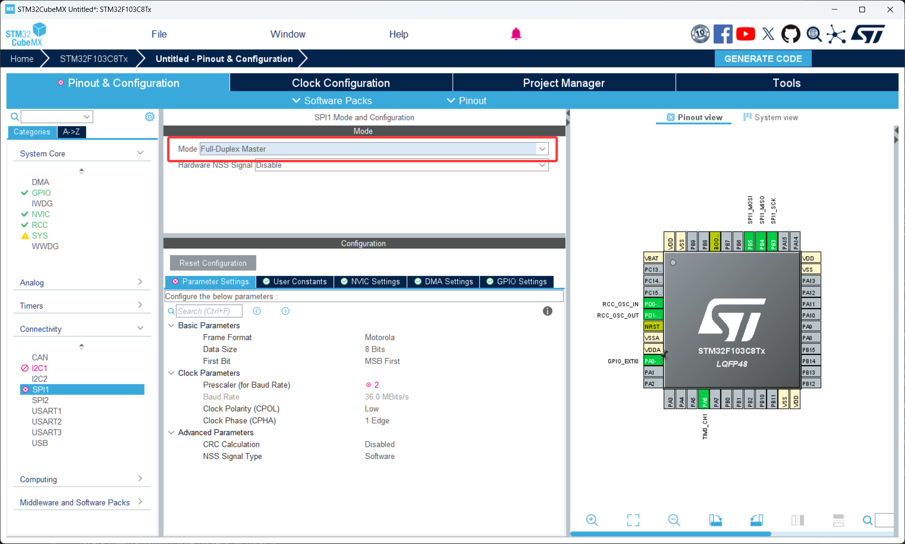
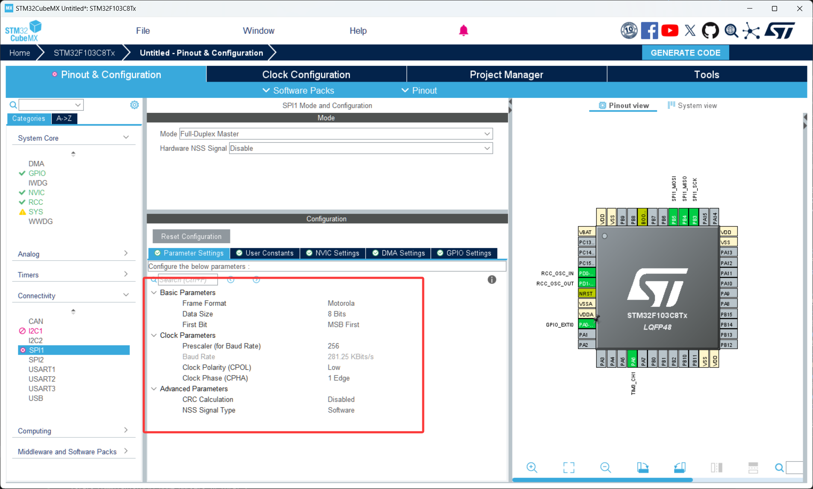
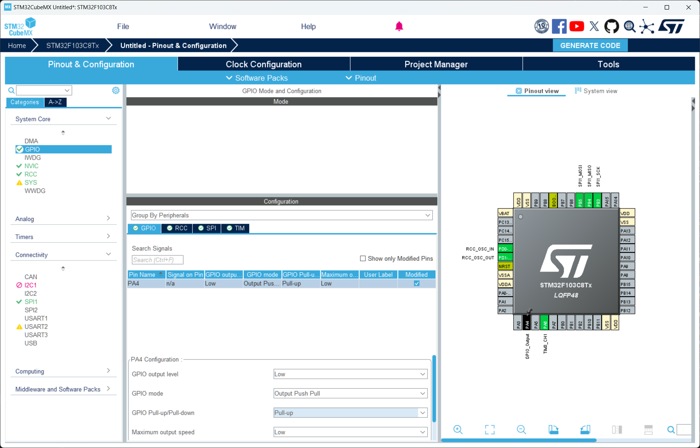

# 第 9 节 · 先约定时钟再传数据：SPI

> 本节目标：理解 SPI 的四线全双工通信原理，掌握 CPOL/CPHA 四种时钟模式的含义，能够用 HAL 库读取一颗 SPI Flash 或 LCD 的器件 ID。

> 如有对应的推荐教程，将在上方出现跳转按钮，可以按需选择观看

## 了解 SPI 是什么

SPI（Serial Peripheral Interface，串行外设接口）是摩托罗拉提出的一种**高速同步全双工通信总线**。它和 I2C 一样有时钟线，但比 I2C 快得多——SPI 跑到几十 MHz 都很常见，而 I2C 通常只有 100kHz~400kHz。

SPI 在嵌入式里几乎是高速外设的标配：

- SPI Flash（W25Q64、W25Q128 这种）
- TFT/IPS 高速显示屏
- 高速 ADC（24 位精度的 ADS1256 等）
- SD 卡（SD 卡可以工作在 SPI 模式）
- 以太网芯片（W5500 等）

通俗地讲，SPI 牺牲了 I2C 的"线少"优势，换来了"快"和"稳"。

那么这里有个问题，既然 SPI 这么快，为什么 OLED 屏幕这种简单器件还普遍用 I2C 而不是 SPI？

答案是 SPI 用的线更多——至少 4 根，挂多个设备时每多一个就多一条片选线，引脚资源吃得很厉害。OLED 这类不需要高速刷屏的器件，I2C 的 100kHz~400kHz 已经够用了，省下的 GPIO 可以挪去做别的事。**选 SPI 还是 I2C 的本质是"速度 vs 线数"的取舍**。

### SPI 的四根线

MOSI（Master Out, Slave In）：主机发送线、从机接收线

MISO（Master In, Slave Out）：主机接收线、从机发送线

SCK（Serial Clock）：时钟线，由主机产生

CS / NSS（Chip Select / Slave Select）：片选线，主机用来告诉从机"我现在在和你说话"。**低电平有效**——拉低开始通信，拉高结束

挂多个 SPI 设备时，前三根线（MOSI、MISO、SCK）是共用的，每个设备各自独占一根片选线。

### SPI 是全双工的

注意 SPI 有 MOSI 和 MISO 两根独立的数据线，主机发数据的同时从机也在发——这就是**全双工**。这一点和 I2C/UART 都不一样：

```
主机发: D7 D6 D5 D4 D3 D2 D1 D0  (走 MOSI)
从机发: R7 R6 R5 R4 R3 R2 R1 R0  (同时走 MISO)
```

所以 SPI 的 HAL API 里，"只想发不想收"的场景照样会调用收发函数，只是把接收数据扔掉。"只想收"的场景也得发一些**dummy 字节**（比如 0xFF）让时钟跑起来，从机才有机会把数据放到 MISO 上。这个特性初学很容易绕晕。

### 时钟模式：CPOL 和 CPHA

SPI 最容易踩坑的就是这两个参数：

CPOL（Clock Polarity，时钟极性）：决定 SCK 空闲时是高电平还是低电平

- CPOL=0：空闲低电平
- CPOL=1：空闲高电平

CPHA（Clock Phase，时钟相位）：决定数据在第几个时钟边沿被采样

- CPHA=0：第一个边沿采样（前沿）
- CPHA=1：第二个边沿采样（后沿）

两个参数组合出 4 种模式：

| 模式 | CPOL | CPHA | 空闲电平 | 采样边沿 |
| --- | --- | --- | --- | --- |
| Mode 0 | 0 | 0 | 低 | 上升沿 |
| Mode 1 | 0 | 1 | 低 | 下降沿 |
| Mode 2 | 1 | 0 | 高 | 下降沿 |
| Mode 3 | 1 | 1 | 高 | 上升沿 |

**主从必须用同一种模式**，不一致最典型的现象是"波形看起来都对，但接收数据全部错位"。Mode 0 和 Mode 3 是工业界用得最多的两种，绝大多数 Flash、显示屏 datasheet 第一页就会写它支持哪种 mode。

### 数据位宽和位序

SPI 还有两个次要参数：

数据位宽：8 位 还是 16 位。绝大多数器件用 8 位，跟 datasheet 走。

位序：MSB First（高位先发，最常见）还是 LSB First（低位先发，少见）。

这俩参数错了表现也很类似——能通信但数据乱。CubeMX 默认就是 8 位 + MSB First，多数情况下不需要动。

## 如何配置 SPI

1. 打开 CubeMX 工程，在左侧 `Connectivity` 里点开 `SPI1`，把 `Mode` 设置为 `Full-Duplex Master`（全双工主机）
2. 在 `Parameter Settings` 里：`Frame Format` 选 `Motorola`，`Data Size` 选 `8 Bits`，`First Bit` 选 `MSB First`，`CPOL` 和 `CPHA` 按你接的器件 datasheet 来选（Flash 类一般 Mode 0），`Prescaler` 决定 SCK 速率，初学先选大一点（比如 256 分频）保证稳定，调通了再加速
3. SPI1 默认占用 PA5(SCK) / PA6(MISO) / PA7(MOSI)，**注意 NSS 选 `Disable`**，自己用一个普通 GPIO（比如 PA4）做软件片选，比硬件 NSS 灵活得多

## 关键代码

1. 配置好后用 CubeMX 生成代码
2. 打开 Keil 工程，SPI 不需要手动启动，CubeMX 生成的初始化代码已经搞定
3. 关键代码

```c
// 全双工收发：发送 N 字节的同时接收 N 字节
uint8_t tx[2] = {0x9F, 0x00};   // 0x9F 是 W25Q64 的 "Read JEDEC ID" 指令
uint8_t rx[2] = {0};

HAL_GPIO_WritePin(GPIOA, GPIO_PIN_4, GPIO_PIN_RESET);  // 拉低 CS，开始通信
HAL_SPI_TransmitReceive(&hspi1, tx, rx, 2, 100);
HAL_GPIO_WritePin(GPIOA, GPIO_PIN_4, GPIO_PIN_SET);    // 拉高 CS，结束通信
// &hspi1：SPI 句柄
// tx：要发送的数据
// rx：接收数据放这里。注意 rx[0] 是发 tx[0] 时同步收到的字节
// 2：本次收发多少字节
// 100：超时 ms


// 只发不收（其实 HAL 内部还是全双工，把接收丢弃）
HAL_GPIO_WritePin(GPIOA, GPIO_PIN_4, GPIO_PIN_RESET);
HAL_SPI_Transmit(&hspi1, tx, 2, 100);
HAL_GPIO_WritePin(GPIOA, GPIO_PIN_4, GPIO_PIN_SET);


// 只收不发（要发 dummy 让时钟跑起来）
uint8_t dummy = 0xFF;
HAL_GPIO_WritePin(GPIOA, GPIO_PIN_4, GPIO_PIN_RESET);
HAL_SPI_Receive(&hspi1, rx, 2, 100);  // HAL 内部会自动发 0xFF dummy
HAL_GPIO_WritePin(GPIOA, GPIO_PIN_4, GPIO_PIN_SET);
```

## 读取 W25Qxx 的 JEDEC ID

读 SPI Flash 的 JEDEC ID 是测 SPI 链路通不通的最经典实验，过程是这样的：

```c
uint8_t tx[4] = {0x9F, 0x00, 0x00, 0x00};   // 第 1 字节是命令，后 3 字节是 dummy
uint8_t rx[4] = {0};

HAL_GPIO_WritePin(GPIOA, GPIO_PIN_4, GPIO_PIN_RESET);
HAL_SPI_TransmitReceive(&hspi1, tx, rx, 4, 100);
HAL_GPIO_WritePin(GPIOA, GPIO_PIN_4, GPIO_PIN_SET);

// rx[0] 是发命令时收到的字节，没用
// rx[1] = 厂商 ID（W25Q 系列是 0xEF）
// rx[2] = 器件型号高字节
// rx[3] = 器件型号低字节，比如 W25Q64 是 0x4017
printf("JEDEC: %02X %02X %02X\n", rx[1], rx[2], rx[3]);
```

如果能稳定打印出 `EF 40 17` 这种合理值，说明你的 SPI 时钟模式、片选时序、接线全都对了。后续就能正常做 Flash 读写了。

## 调试 SPI 的标准顺序

1. **片选**：先用万用表或示波器确认 CS 在 SPI 操作期间确实被拉低，操作结束又被拉高
2. **时钟模式**：CPOL/CPHA 不对会导致"波形漂亮但数据全错"。优先怀疑这两个
3. **数据位宽和位序**：8/16 位、MSB/LSB 是不是和 datasheet 一致
4. **速度**：先用最低速度（256 分频）调通，再逐步提速。线长走线差时高速会丢位

如果手边有逻辑分析仪，**优先抓波形看**——SPI 的波形非常直观，错在哪一眼能看出来。

## 常见问题排查

| 现象 | 原因 |
| --- | --- |
| 收到数据全是 0x00 或 0xFF | CS 没拉低；MISO 接反；从机没上电 |
| 有波形但数据全错 | CPOL/CPHA 模式不对；位序选反 |
| 第一字节对、后面错 | 通信中途 CS 被释放了；或时钟太快从机跟不上 |
| 多设备时收到错乱数据 | 某个 CS 没正确管理，多个从机同时驱动 MISO |
| 高速时偶发出错 | 走线太长、导线太细、上拉电阻不合理 |

## 本章任务

用你手里的小蓝板和一颗 SPI Flash（W25Q64 / W25Q128）或 SPI 接口的 OLED 实现：

1. 配置 SPI1 + PA4 软件片选，先用 256 分频跑稳，读取 W25Qxx 的 JEDEC ID 并通过串口打印，确认能稳定看到 `EF XX XX`
2. 读取 W25Qxx 任意地址的 256 字节内容并打印（默认应该是 0xFF，因为出厂未写入）
3. （进阶）逐步把 SPI 分频从 256 降到 16、8、4，看看高速时数据还稳不稳，体会高速 SPI 对硬件走线的要求
