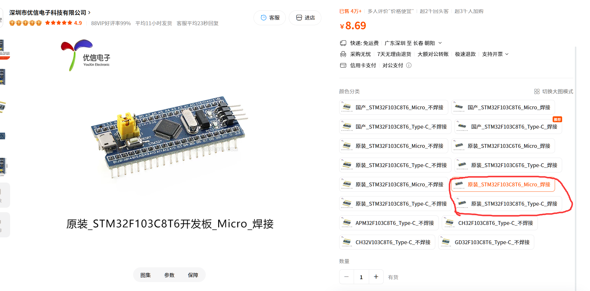

# 第二章 · 入门：玩转小蓝板

> 本章目标：以 STM32F103C8T6 小蓝板为实验平台，把入门阶段最常见的基础外设和通信方式完整走一遍。

## 写在前面

本章内容都需要基于小蓝板进行，我们推荐的购买链接在这里:[购买链接](https://item.taobao.com/item.htm?abbucket=2&id=946102518580&mi_id=0000tRsMilA0ArrUAzne9rQ13a4rEdN7RG1_fL0ko6OsDuA&ns=1&skuId=5854281617648&spm=a21n57.1.hoverItem.2&utparam=%7B%22aplus_abtest%22%3A%2225d8ad52cd66b5fb107cb438fe1687cc%22%7D&xxc=taobaoSearch)  

一定要买红圈里面的两款哦！！！！！！

关于剩下的面包板/开发套件我们的建议是这样的:
大家只需要买一块面包板、少量杜邦线、少量LED灯、一个stlink和一个USB转TTL模块即可
购买链接如下：

面包板:[购买链接](https://item.taobao.com/item.htm?id=522572405070&pisk=gWBS8dmO64059Iq8J4rqcKvPEk9CdoyweDtdjMHrvLp8pwsN2gRF2uqIdwI9YUSFae1fjwTzx7vPGe_AlUHzq7ApRaYV8vSPdsDCjMXzqprkEgvHpPzaQeslqpVbYe3lF-hvbihKpvF2HET461aaQRSbw3vFDP5y3MweDhkppQLJHmLDx3HRJQLvHExHv4ppyosvoEKp2UKdDnKwV03RJ3dvMh-Mvvpp2i3vxELppeLLciLDApLdJpEfDvgjhHFWXgZpnIWLEcqFVEMKpttY-FISgv-fH3GB7gTbW8BbIQTO2EMLPy55ReTcBrPfm_CRznbQCr9ho6QpAZ3Y8QjdGZt5zPgH8TjPdUS7wrIX3UsMliwssN95RCBJGDHF4pTyhnBTYfYVhU7dFIEZCBJAQCpRgS4yTLt1JTbSAvQO0GWki9askefyjKKNq8MXBgKd45Mw5uVIOmOidnTacoGntuMMpuR1yDgJwnx77oZjrXAJmnTacoGntQKDVGrbc4ch.&spm=a1z10.3-c-s.w4002-24706531953.12.523b6a4b05rE7m)

杜邦线:[购买链接](https://item.taobao.com/item.htm?id=522573222630&pisk=gCZt82T5e6finvICwhb3m7umvY6hEw2a95yWmjcMlWFLIW8MiP20vnFUwlxmoc4ADSGHmOoGumFx9SliScGMDmeYgS0bmjqvQkFJmhfN7-txmm1lZgjuQAmqc_bdom1HQxDjGEODfDwImxEs5bB0QRoqGpAfrywNDBNjOZMjG9nIhxdjcfgsO9Hm3Cij1qOQdxGIGmNjlDGIextX5FT6O9HonxT6ffgIRxHkfjNjc9KITxijCSifpJGEhvwdWXpspnUCmfg5rhQvmnqKBVhvmXKxblKo7b1EOnKx6cg9SRGpcnZLlLqScf_yKjoi_uHTgg-ZfqUznxFOXhNYUkPKd7svqfwUEz0afZxoyDhtulwhy3n__x3Sc2pXcJnZt2ZZVgOKLywgllP9HnMaju0xa2BX0qmQq4a76KWzdcMbg4rcahl_h8rzr0IH50wLl7UA4ZZu2CIpZbHD59BpuEusLwThc2ia-0DspbXtBE8qlvkKZ9BpuEusLvhlBCL2uqMF.&spm=a1z10.3-c-s.w4002-24706531953.23.523b6a4b05rE7m)

LED灯:[购买链接](https://item.taobao.com/item.htm?id=526297340430&pisk=g-AE-HgEcXhEawoDuEfrQGByW-1da_ofxQs5rUYlRMj3d6NurHt1KptSJg7kzhBWRDLlr_-MV2IBrDKyaGYJd2BSvzJwvEXB4U3drgxk4g9ICjTpJ_Coc7ljGeLQHkyWY7XhS4bdkw01KDRNPj5ocmGzCPXKA_YCfbU6IRbAjwVhE_0NjZ_VZwbhxVSGzZIut3fo7V7Puublqwfgsa7VZJXlrOcGoaFlqgjHSV7RjwflZ3fi7aIGq_foIHRkT5SFK2uAW1yK-9WFmejagFdN-bIqMGVoxCbe7i8ne7Vk_wWe_xdZ-VWBEEBvOCcz66T2I1bXJXPNieb2AGtmi55M5Fx5Hdn8GOKwaTAhdzmRKHJMlLXZ-XYNTMWX6tz8d6JkvQWpLz3vS6x9HiBnBcQwOI6PDOrixFTNxtJyAcFlAK8MbtO_fS1JXLxlzhqF4bERSwCMwpruU9bO7igZ7Uwd00H2p0n0e8BiWNSjuqy8e9bO7igZ78eRIhQNcquV.&spm=a1z10.3-c-s.w4002-24706531953.17.2e446a4bUf6iKj)

STLINK:[购买链接](https://detail.tmall.com/item.htm?ali_refid=a3_420434_1006%3A2072013393%3AH%3AMXngtKJe48FnLBBMs3rZaA%3D%3D%3A047b230bc977177d8e8fbeb88b837d71&ali_trackid=282_047b230bc977177d8e8fbeb88b837d71&id=628485644622&mi_id=0000yr3hFQYO5TVqxuxRRB1A8p-8AAOmHPMN0czFGhbEgUo&mm_sceneid=1_0_7107066615_0&skuId=6117216994179&spm=a21n57.1.hoverItem.13&utparam=%7B%22aplus_abtest%22%3A%22aa5827d70232a014cb026cc2fe9c914c%22%7D&xxc=ad_ztc)

USB转TTL:[购买链接](https://item.taobao.com/item.htm?id=522571378803&pisk=grynS7f2iWlIMdTNnUkC6dg3ulf9RvMSRzp-yY3P_Vu6pzHKeAuZ20Lr4LlE75qbr2I5OvFirPzi8pICObuuRVUJekeu1LqbVJIIeMMQAYMPkZBxrkZIFFu5QoeH7CobbQJra1HZx4pdDZBAHlAwHVjGkWHTqFoiDLkrT2labViWa4zrTcWZ50iy8YuFjlus70uraLJNQ0ok8BzrYflZDmieLpJyblor74krUzrNj03ZzYkzzlkgnHu4U7yNuI3Baaka7RmntqrGGLJlsD8xokr2EL0nxXfLYVvyURVyD-PK8sttPv3QnD45hpMEZSZ-qyXHLzqbCPmauTvx8lZYMXwFwKhmI2c7LlCDnvzIqjkrs3Jzjvgt_JMV3Fm__kFzdyxkUDwLHb0jsgJSwAyxgSzHViZZL0zSG8QXd2rzc-NxnOdE3lVzo7jz1CRq6jvSbgewNQGEfc0x_E5Tf3cOH9IGjINSTcimkGjMNQGEfc0AjGAfPXosmqC..&spm=a1z10.3-c-s.w4002-24706531953.11.4af26a4bPOX6ud)

## 为什么先练小蓝板

小蓝板资料多、成本低、功能够用，非常适合把 STM32 的基本功练扎实。只要这一章做顺了，后面切到更复杂的控制板，思路基本是一致的。

## 本章你会收获什么

- 认识板子上的供电、时钟、下载和常用引脚。
- 独立完成 GPIO、EXTI、TIM、PWM、UART、I2C、SPI 的基础实验。
- 建立“外设配置 -> 初始化代码 -> 应用逻辑 -> 现象验证”的完整闭环。

## 建议操作方式

1. 每节都新建一个最小工程，避免把多个实验堆在一起。
2. 先让现象出现，再考虑抽象封装，不要倒过来。
3. 每做完一个实验，记录引脚表、时钟配置和关键代码。

## 本章内容

- 第 0 节：认识小蓝板，知道每根常用引脚的大致用途。
- 第 1 节：点亮板载 LED，跑通最小应用。
- 第 2 节到第 4 节：理解中断、定时器和 PWM。
- 第 5 节到第 9 节：掌握串口、I2C、SPI 等常见通信方式。

## 做完本章后的标准

如果你已经能独立配置一个外设、写出最小测试程序并解释它为什么工作，那这章就算真正学会了。