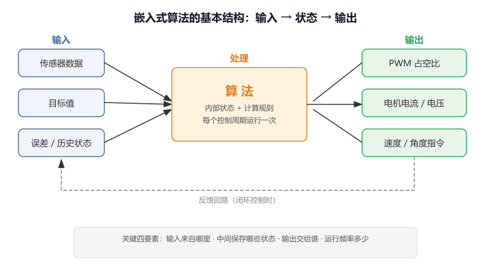

# 第 0 节 · 先分清输入输出：什么叫算法

> 本节目标：把"算法"从抽象名词变成可落地的软件结构，建立"输入 → 状态 → 输出"的基本思维框架，为后面每一节打好地基。

> 如有对应的推荐教程，将在上方出现跳转按钮，可以按需选择观看

## 在嵌入式里，算法到底是什么

很多人一听到"算法"就想到大学课本上的排序、搜索、动态规划。但在嵌入式控制领域，算法的含义更具体：**一段把输入加工成输出的规则，并且通常带有内部状态**。

通俗地讲，算法就像一个"黑盒子"——你往里面喂数据（传感器读数、目标值、误差），它内部做一番计算，然后吐出一个结果（电机电流、PWM 占空比、角度指令）。

```
  传感器数据 ──┐
               │    ┌──────────┐
  目标值 ──────┼───>│  算 法   │───> 控制输出（PWM / 电流 / 速度）
               │    │ (内部状态)│
  历史状态 ────┘    └──────────┘
```

那么这里有个问题，既然我可以直接写一堆 `if-else` 来判断"传感器值大了就减小输出、小了就增大输出"，那我为什么还要学什么算法？

答案是 `if-else` 只能处理最简单的情况。一旦你的系统需要平滑过渡、需要消除稳态误差、需要融合多个传感器、需要在噪声中提取真实信号——简单的条件判断就完全不够用了。算法提供的是**经过数学验证的、可调参的、可复用的处理框架**，比你自己拍脑袋写的逻辑稳定得多。

## 一个算法最少要说清四件事

不管多复杂的算法，你在动手写代码之前，都应该先回答这四个问题：

**输入来自哪里**：是 ADC 采样值？编码器计数？IMU 的角速度？还是上位机发来的目标值？

**中间保存了哪些状态**：上一次的输出值？累积的误差？历史数据的加权平均？算法之所以不是纯函数，就是因为它需要"记住"一些东西。

**输出交给谁使用**：是直接写进 PWM 的 CCR 寄存器？还是作为下一级算法的输入？

**运行频率是多少**：1ms 跑一次和 10ms 跑一次，同样的参数会产生完全不同的效果。很多初学者调参怎么都调不好，最后发现是运行频率不对。



## 嵌入式算法的代码长什么样

在嵌入式项目里，一个算法通常被封装成一个**结构体 + 一组函数**。结构体保存内部状态，函数负责初始化和每次更新。这是最常见的写法模板：

```c
// 算法结构体：保存所有内部状态
typedef struct {
    float state_1;    // 内部状态变量 1
    float state_2;    // 内部状态变量 2
    float output;     // 当前输出值
} MyAlgorithm_t;

// 初始化：把所有状态清零或设为默认值
void MyAlgorithm_Init(MyAlgorithm_t *alg)
{
    alg->state_1 = 0.0f;
    alg->state_2 = 0.0f;
    alg->output  = 0.0f;
}

// 更新：每个控制周期调用一次，传入新的输入，返回新的输出
float MyAlgorithm_Update(MyAlgorithm_t *alg, float input)
{
    // 1. 用输入和内部状态做计算
    // 2. 更新内部状态
    // 3. 返回输出
    alg->output = /* 某种计算 */;
    return alg->output;
}
```

后面你会看到，斜坡、低通滤波、PID、卡尔曼滤波全都是这个套路——只是结构体里的状态变量和 `Update` 函数里的计算公式不同而已。

## 一个最简单的例子：限幅

为了让你直观感受"算法"在代码里长什么样，我们先看一个最简单的：**限幅（Clamp）**。它的作用是把输出限制在一个安全范围内，防止给电机的指令超出物理极限。

```c
// 限幅算法：把 value 限制在 [min, max] 范围内
float Clamp(float value, float min, float max)
{
    if (value > max) return max;
    if (value < min) return min;
    return value;
}

// 使用示例：电机 PWM 占空比不能超过 100%，也不能为负
float motor_output = PID_Update(&pid, error);
motor_output = Clamp(motor_output, 0.0f, 1000.0f);
__HAL_TIM_SET_COMPARE(&htim3, TIM_CHANNEL_1, (uint16_t)motor_output);
```

这就是一个算法——虽然只有三行，但它有明确的输入（value）、明确的输出（限幅后的值）、明确的用途（保护执行器）。后面的算法只是比它复杂，思路是一样的。

## 为什么很多人学算法会卡住

因为一开始只盯公式，没有先建立"这段代码到底在解决什么问题"的问题意识。

正确的学习顺序是：

1. **先搞清楚它解决什么问题**——不知道问题就看不懂答案
2. **再看输入和输出**——画出"什么进去、什么出来"
3. **然后看内部状态**——它需要"记住"什么
4. **最后才看公式和代码**——这时候公式就不再是天书了

## 本章后续内容预览

| 节 | 算法 | 一句话说明 | 解决什么问题 |
| --- | --- | --- | --- |
| 第 1 节 | 斜坡（Ramp） | 限制变化速度 | 指令跳变导致的机械冲击 |
| 第 2 节 | 低通滤波 | 压制高频噪声 | 传感器数据毛刺太多 |
| 第 3 节 | PID | 用误差做闭环控制 | 让系统跟上目标值 |
| 第 4 节 | 卡尔曼滤波 | 融合模型和测量 | 多传感器数据不一致 |
| 第 5 节 | LQR | 最优状态反馈 | 在响应速度和控制代价间找平衡 |

## 一个简单判断标准

如果你能用一句话说出"它把什么变成什么"，那你就已经开始真正理解这个算法了。比如：

- 斜坡："把跳变的目标值变成平滑逼近的输出"
- 低通滤波："把带噪声的原始信号变成平滑的趋势信号"
- PID："把目标值和当前值的误差变成控制输出"

带着这个思路，我们从最简单的斜坡算法开始。

## 本章任务

1. 在纸上画出一个你熟悉的控制场景（比如空调控温、电机调速），标出输入、输出和你认为需要的内部状态
2. 用上面的代码模板，写一个"死区算法"：输入绝对值小于某个阈值时输出 0，否则原样输出。用结构体保存阈值参数
3. （进阶）思考：为什么嵌入式算法几乎都要知道"运行频率"？如果同一个算法从 1kHz 换到 100Hz 运行，哪些参数可能需要重新调？
