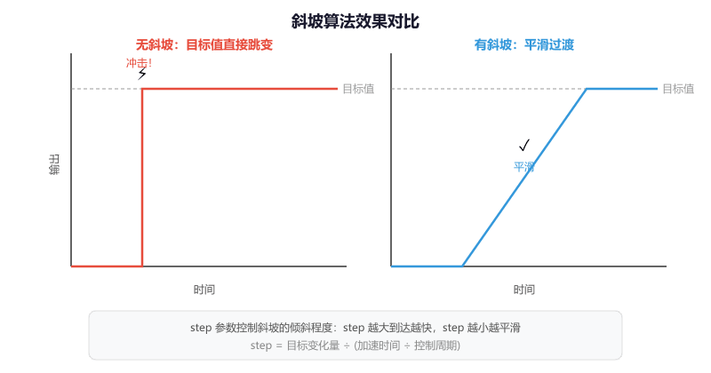
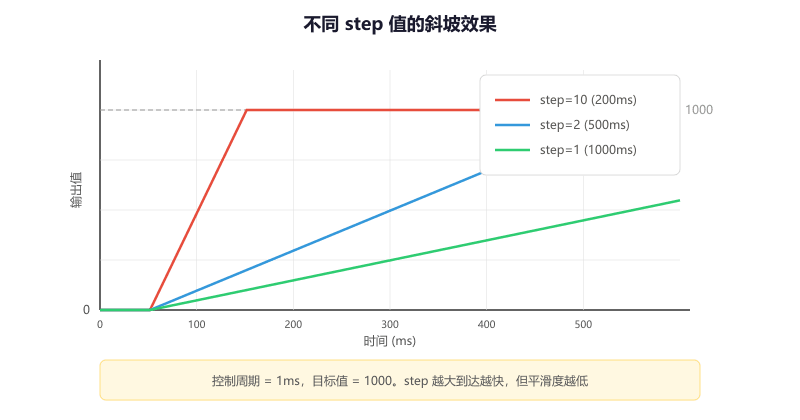

# 第 1 节 · 先限制变化速度：斜坡算法

> 本节目标：理解为什么很多控制量不能一步跳到目标值，掌握斜坡算法（Ramp）的原理、实现和调参方法，能在定时器中断里跑通一个平滑启动的电机控制。

> 如有对应的推荐教程，将在上方出现跳转按钮，可以按需选择观看

## 斜坡算法解决什么问题

想象你开车，油门从 0 一脚踩到底会怎样？轮胎打滑、乘客被甩、变速箱冲击。所以正常人都是慢慢踩油门，让速度**逐渐**上去。

嵌入式控制也一样。如果你的代码直接把电机目标速度从 0 跳到 5000 RPM，会发生什么？

- 电源瞬间大电流，可能触发过流保护
- 齿轮箱承受巨大冲击力，加速磨损
- 底盘猛然启动，机器人可能翻车

**斜坡算法的作用就是：限制输出的变化速率，让指令平滑地从当前值逼近目标值，而不是一步跳过去。**

```
  目标值突变          加了斜坡后
  （危险）            （平滑）

  5000 ┤·········    5000 ┤        ·····
       │        :         │      ·
       │        :         │    ·
       │        :         │  ·
     0 ┤────────:       0 ┤·
       └────────→         └──────────→
         时间                时间
```

那么这里有个问题，既然我可以用 `HAL_Delay` 配合 `for` 循环慢慢递增目标值，那我为什么还要专门写一个斜坡算法？

答案是 `HAL_Delay` 会阻塞 CPU。你在 `for` 循环里等的那几百毫秒，主循环里别的任务全部停摆——传感器不读了、通信不处理了、其他电机也不控制了。斜坡算法是**非阻塞的**，每次调用只做一步计算，配合定时器中断使用，CPU 该干嘛干嘛。

## 核心原理

斜坡算法的逻辑非常简单，每次调用时做三件事：

1. 如果目标值比当前值**高出超过一步**，就只往上走一步
2. 如果目标值比当前值**低出超过一步**，就只往下走一步
3. 如果差距已经**不到一步**了，直接到达目标值

```
每次调用的逻辑：

  目标远在上方？  ──> 当前值 + step
  目标远在下方？  ──> 当前值 - step
  目标已经很近？  ──> 直接等于目标值
```

这个"一步"就是 `step` 参数，它决定了每个控制周期允许变化多少。`step` 越大，到达目标越快但越不平滑；`step` 越小，越平滑但越迟钝。

## 完整实现

### 结构体定义

```c
typedef struct {
    float output;     // 当前输出值
    float step;       // 每次最大变化量
} Ramp_t;
```

### 初始化函数

```c
// 初始化斜坡算法
// step：每个控制周期允许的最大变化量
void Ramp_Init(Ramp_t *ramp, float step)
{
    ramp->output = 0.0f;
    ramp->step   = step;
}
```

### 更新函数

```c
// 每个控制周期调用一次
// target：目标值
// 返回值：经过斜坡限制后的输出值
float Ramp_Update(Ramp_t *ramp, float target)
{
    float diff = target - ramp->output;

    if (diff > ramp->step)
        ramp->output += ramp->step;      // 目标在上方，往上走一步
    else if (diff < -ramp->step)
        ramp->output -= ramp->step;      // 目标在下方，往下走一步
    else
        ramp->output = target;           // 差距不到一步，直接到达

    return ramp->output;
}
```



## 在 STM32 上使用

斜坡算法通常放在**定时器中断**里运行，保证每次调用的时间间隔是固定的。下面是一个完整的使用示例：

```c
// 全局变量
Ramp_t motor_ramp;
float motor_target = 0.0f;    // 目标速度，由上位机或遥控器设置

// main 函数里初始化
// 假设定时器 1ms 中断一次，step=5 表示每毫秒最多变化 5
Ramp_Init(&motor_ramp, 5.0f);
HAL_TIM_Base_Start_IT(&htim2);  // 启动 1ms 定时器中断

// 定时器中断回调
void HAL_TIM_PeriodElapsedCallback(TIM_HandleTypeDef *htim)
{
    if (htim->Instance == TIM2)
    {
        // 每 1ms 更新一次斜坡输出
        float smooth_output = Ramp_Update(&motor_ramp, motor_target);

        // 把平滑后的值写入 PWM
        if (smooth_output < 0) smooth_output = 0;
        __HAL_TIM_SET_COMPARE(&htim3, TIM_CHANNEL_1, (uint16_t)smooth_output);
    }
}

// 主循环里可以随时改变目标值，斜坡会自动平滑过渡
while (1)
{
    motor_target = 800.0f;   // 设定目标
    HAL_Delay(3000);
    motor_target = 200.0f;   // 改变目标，斜坡会自动减速
    HAL_Delay(3000);
    motor_target = 0.0f;     // 停车
    HAL_Delay(3000);
}
```

## step 参数怎么算

`step` 不是随便填的，它和你的**控制周期**以及**期望的加速时间**直接相关：

```
step = 目标变化量 / (加速时间 / 控制周期)
```

举个例子：你希望电机从 0 加速到 1000（PWM 值），用时 500ms，定时器每 1ms 中断一次：

```
step = 1000 / (500ms / 1ms) = 1000 / 500 = 2.0
```

也就是每毫秒增加 2，500 次后到达 1000。

| 期望加速时间 | 控制周期 | 目标变化量 | step |
| --- | --- | --- | --- |
| 200ms | 1ms | 1000 | 5.0 |
| 500ms | 1ms | 1000 | 2.0 |
| 1000ms | 1ms | 1000 | 1.0 |
| 500ms | 5ms | 1000 | 10.0 |

**注意**：如果你把控制周期从 1ms 改成 5ms 但 `step` 不变，加速时间就会变成原来的 5 倍。这就是为什么第 0 节说"运行频率不对，参数就全乱了"。



## 进阶：可变步长斜坡

有时候你希望加速快一点、减速慢一点（或者反过来），这时候可以用两个不同的 step：

```c
typedef struct {
    float output;
    float step_up;     // 加速步长（往目标增大方向）
    float step_down;   // 减速步长（往目标减小方向）
} RampEx_t;

float RampEx_Update(RampEx_t *ramp, float target)
{
    float diff = target - ramp->output;

    if (diff > ramp->step_up)
        ramp->output += ramp->step_up;
    else if (diff < -ramp->step_down)
        ramp->output -= ramp->step_down;
    else
        ramp->output = target;

    return ramp->output;
}
```

典型场景：底盘启动可以快一点（step_up 大），但刹车要慢一点防止惯性甩尾（step_down 小）。

## 常见问题排查

| 现象 | 原因 |
| --- | --- |
| 输出完全不动 | `step` 设成了 0，或者忘了在定时器中断里调用 `Ramp_Update` |
| 输出直接跳到目标值 | `step` 太大，一步就到了；或者控制周期太长 |
| 加速很慢，感觉迟钝 | `step` 太小，需要根据公式重新计算 |
| 改了控制周期后行为变了 | `step` 没有跟着调整，参见上面的计算公式 |
| 目标值来回跳时输出抖动 | 目标值本身不稳定，需要在斜坡前面再加一级滤波 |

## 本章任务

用你手里的小蓝板实现：

1. 配置 TIM2 每 1ms 中断一次，在中断里用斜坡算法平滑控制 LED 的 PWM 亮度，实现一个"慢启动"效果：上电后 LED 在 1 秒内从灭渐亮到最亮
2. 通过串口发送不同的目标值（比如 0、500、1000），观察斜坡算法如何平滑过渡，用串口打印当前输出值验证曲线
3. （进阶）实现可变步长斜坡：加速用 200ms，减速用 500ms，观察"快启动、慢刹车"的效果
