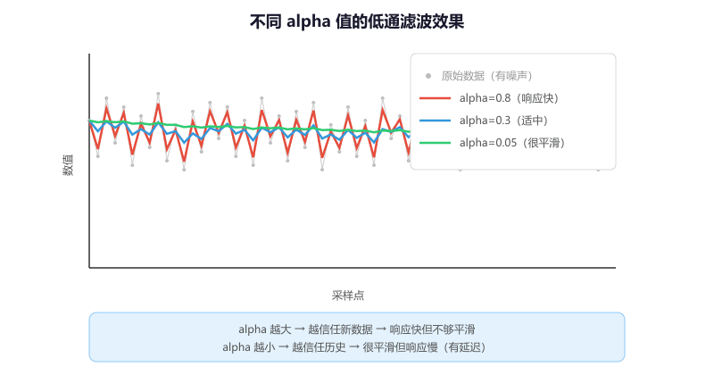
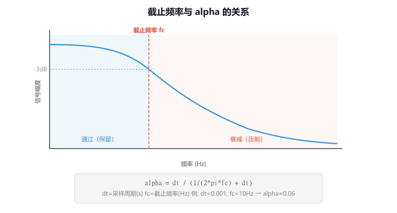
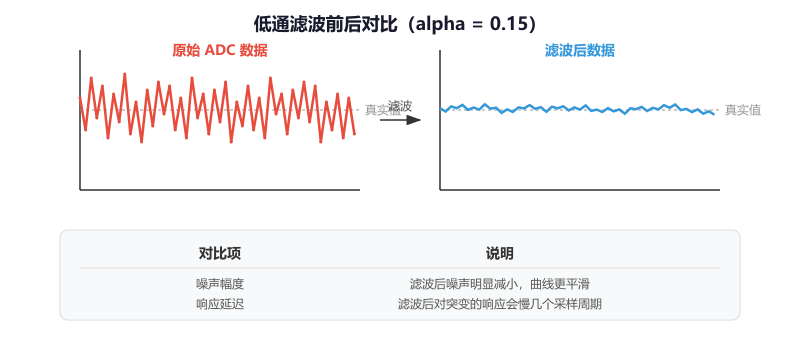

# 第 2 节 · 先压掉高频噪声：低通滤波器

> 本节目标：理解为什么传感器数据不能原样直接拿去控制，掌握一阶低通滤波器的原理、alpha 参数的含义和计算方法，能在 STM32 上对 ADC 采样数据做实时滤波。

> 如有对应的推荐教程，将在上方出现跳转按钮，可以按需选择观看

## 为什么传感器数据不能直接用

你用 ADC 采样一个电位器的电压，理论上转到某个位置应该是一个稳定的值，比如 2048。但实际读出来的数据长这样：

```
  2080 ┤    *
  2060 ┤  *   *        *
  2048 ┤·····*···*··*·····*···  ← 真实值
  2030 ┤        *  * *      *
  2010 ┤              *
       └──────────────────────→ 时间
```

数据在真实值附近上下跳动，这就是**噪声**。噪声来源很多：电源纹波、电磁干扰、ADC 本身的量化误差、导线上的感应电压……在嵌入式系统里，噪声是无法完全消除的物理现实。

如果你把这个带噪声的原始数据直接喂给 PID 控制器，PID 的 D 项（微分项）会把噪声当成"快速变化"来响应，导致输出剧烈抖动，电机嗡嗡叫。

**低通滤波器的作用就是：保留数据中缓慢变化的趋势（低频信号），压制快速跳动的噪声（高频信号）。**

那么这里有个问题，既然我可以把最近 10 次采样取平均值来平滑数据，那我为什么还要学低通滤波？

答案是取平均（均值滤波）虽然简单，但有两个明显缺点：一是需要开一个数组存历史数据，占内存；二是所有历史数据权重相同，最新的数据和 10 次之前的数据一样重要，响应会比较慢。一阶低通滤波只需要**一个变量**保存上次的输出，而且天然地给最新数据更高的权重，实现简单、内存省、效果好。

## 一阶低通滤波的核心公式

整个算法就一行代码：

```c
output = output + alpha * (input - output);
```

换一种写法更容易理解：

```c
output = (1 - alpha) * output + alpha * input;
//        ↑ 旧数据的权重         ↑ 新数据的权重
```

**`alpha` 是 0 到 1 之间的一个数，决定了新数据占多大比重：**

- `alpha = 1.0`：完全相信新数据，等于没滤波
- `alpha = 0.0`：完全忽略新数据，输出永远不变
- `alpha = 0.5`：新旧各占一半
- `alpha = 0.1`：只取 10% 的新数据，滤波很重，输出很平滑但反应慢
- `alpha = 0.8`：取 80% 的新数据，滤波很轻，反应快但平滑效果弱

通俗地讲，`alpha` 就是一个"信任旋钮"——往右拧（alpha 大）就更信任最新的测量值，往左拧（alpha 小）就更信任之前的历史趋势。



## 完整实现

### 结构体定义

```c
typedef struct {
    float alpha;      // 滤波系数，范围 (0, 1]
    float output;     // 当前滤波输出
} LowPass_t;
```

### 初始化函数

```c
// 初始化低通滤波器
// alpha：滤波系数，越大响应越快，越小越平滑
void LowPass_Init(LowPass_t *lp, float alpha)
{
    lp->alpha  = alpha;
    lp->output = 0.0f;
}
```

### 更新函数

```c
// 每次有新的采样数据时调用
// input：原始采样值
// 返回值：滤波后的值
float LowPass_Update(LowPass_t *lp, float input)
{
    lp->output = lp->output + lp->alpha * (input - lp->output);
    return lp->output;
}
```

就这么简单——一个结构体、两个函数、一行核心计算。

## alpha 怎么选

### 方法一：凭经验试

对于大多数入门场景，直接试几个值就行：

| 场景 | 建议 alpha | 效果 |
| --- | --- | --- |
| ADC 电位器读数 | 0.1 ~ 0.3 | 平滑，适合慢变化信号 |
| IMU 陀螺仪原始数据 | 0.2 ~ 0.5 | 去毛刺但保留动态 |
| 电机速度估计 | 0.05 ~ 0.2 | 重度平滑，适合速度环输入 |
| 温度传感器 | 0.01 ~ 0.05 | 温度变化本来就慢，可以滤得很重 |

### 方法二：从截止频率计算

如果你知道想要的截止频率（高于这个频率的信号会被压掉），可以用公式算出 alpha：

```
alpha = dt / (RC + dt)

其中：
  dt = 采样周期（秒），比如 1ms 中断就是 0.001
  RC = 1 / (2 * π * fc)
  fc = 截止频率（Hz）
```

举个例子：采样周期 1ms，想要截止频率 10Hz（压掉 10Hz 以上的噪声）：

```
RC = 1 / (2 * 3.14159 * 10) = 0.01592
alpha = 0.001 / (0.01592 + 0.001) = 0.059
```

也就是 alpha ≈ 0.06，滤波比较重，适合对平滑度要求高的场景。



## 在 STM32 上使用：ADC 采样滤波

下面是一个完整的例子，用低通滤波器平滑 ADC 采样数据：

```c
// 全局变量
LowPass_t adc_filter;

// main 函数里初始化
LowPass_Init(&adc_filter, 0.1f);  // alpha=0.1，比较平滑
HAL_TIM_Base_Start_IT(&htim2);     // 启动 1ms 定时器中断

// 定时器中断回调：每 1ms 采样一次并滤波
void HAL_TIM_PeriodElapsedCallback(TIM_HandleTypeDef *htim)
{
    if (htim->Instance == TIM2)
    {
        // 读取 ADC 原始值
        HAL_ADC_Start(&hadc1);
        HAL_ADC_PollForConversion(&hadc1, 10);
        uint16_t raw = HAL_ADC_GetValue(&hadc1);

        // 低通滤波
        float filtered = LowPass_Update(&adc_filter, (float)raw);

        // 用滤波后的值控制 PWM
        __HAL_TIM_SET_COMPARE(&htim3, TIM_CHANNEL_1, (uint16_t)filtered);
    }
}
```

## 滤波效果对比

用串口把原始值和滤波后的值同时打印出来，在串口绘图工具里可以直观看到效果：

```c
// 在主循环里打印（不要在中断里打印，会阻塞）
printf("raw:%d,filtered:%.1f\r\n", raw_value, filtered_value);
```

```
  原始数据（噪声明显）        滤波后（平滑）

  2080 ┤ * *   *              2060 ┤
  2060 ┤*   * * *  *          2055 ┤    ···
  2048 ┤·····*····*··         2050 ┤···     ···
  2030 ┤       *    **        2045 ┤           ···
  2010 ┤             *        2040 ┤
       └──────────────→            └──────────────→
```



## 滤波的代价：延迟

滤波不是免费的午餐。**alpha 越小，输出越平滑，但对真实变化的响应也越慢。**

想象你快速转动电位器，原始数据立刻跟上了，但滤波后的数据要过好几个周期才能追上来——这就是滤波引入的**延迟**（也叫相位滞后）。

如果你的控制系统对响应速度要求很高（比如平衡车的姿态控制），滤波太重会让系统"慢半拍"，反而更容易失控。所以 alpha 的选择永远是在**平滑度**和**响应速度**之间做权衡。

## 低通滤波 vs 均值滤波 vs 中值滤波

| 特性 | 一阶低通 | 均值滤波 | 中值滤波 |
| --- | --- | --- | --- |
| 内存占用 | 1 个 float | N 个采样值的数组 | N 个采样值的数组 |
| 计算量 | 极小（一次乘加） | 小（求和除以 N） | 较大（需要排序） |
| 对突变的响应 | 指数衰减，有拖尾 | 线性延迟 | 能完全滤掉孤立尖刺 |
| 适合场景 | 通用，最常用 | 简单平滑 | 有偶发大尖刺的信号 |

**入门建议**：先用一阶低通，90% 的场景够用。遇到偶发的大尖刺（比如超声波传感器偶尔读出一个离谱的值），再考虑中值滤波。

## 常见问题排查

| 现象 | 原因 |
| --- | --- |
| 滤波后数据完全不动 | alpha 设成了 0，或者忘了调用 `LowPass_Update` |
| 滤波后和原始数据一样抖 | alpha 太大（接近 1），几乎没有滤波效果 |
| 滤波后数据跟不上真实变化 | alpha 太小，滤波太重，需要增大 alpha |
| 上电后滤波输出从 0 慢慢爬升 | 初始化时 output 是 0，需要几个周期才能追上真实值。可以在第一次采样时直接把 output 设为采样值 |
| 换了采样频率后滤波效果变了 | alpha 和采样频率有关，换频率要重新算 alpha |

## 本章任务

用你手里的小蓝板实现：

1. 配置 ADC 采样一个电位器（或者直接采样内部温度传感器），用低通滤波器平滑数据，通过串口同时打印原始值和滤波值，在串口绘图工具里对比效果
2. 分别用 alpha=0.01、0.1、0.5、0.9 做实验，快速转动电位器，观察不同 alpha 下的平滑度和响应速度差异
3. （进阶）实现一个"自适应初始化"：第一次调用 `LowPass_Update` 时，直接把 output 设为输入值，避免上电后从 0 慢慢爬升的问题
