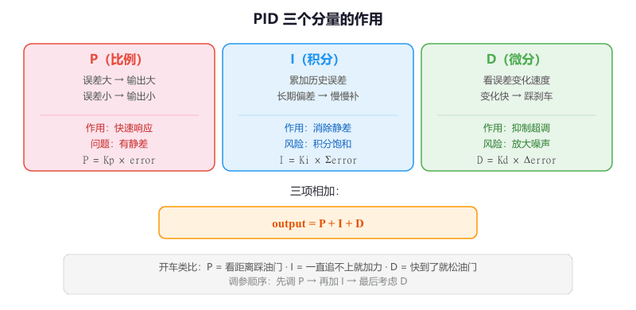
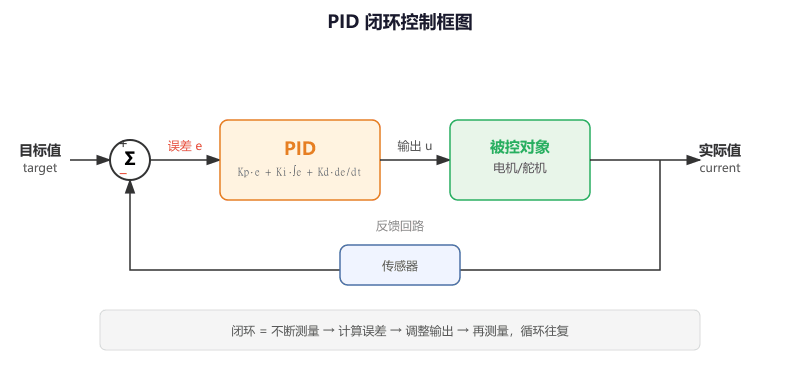
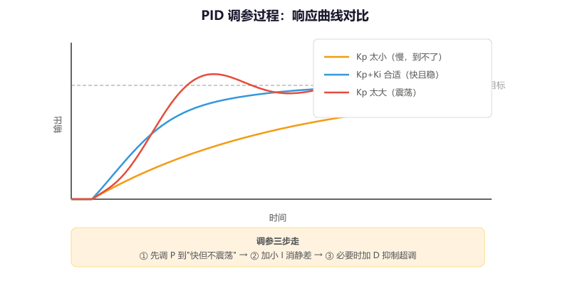

# 第 3 节 · 先用误差闭环：PID

> 本节目标：理解 PID 的三个分量分别在补什么，掌握位置式 PID 的完整实现，知道最基本的调参顺序和常见的保护措施（限幅、积分分离、输出滤波）。

> 如有对应的推荐教程，将在上方出现跳转按钮，可以按需选择观看

## PID 在解决什么问题

前面学的斜坡和低通滤波都是"开环"的——它们不关心系统实际到了哪里，只管按自己的节奏处理数据。但在真实控制场景里，你需要的是**闭环**：不断测量"现在在哪"，和"想去哪"做比较，然后决定"该怎么动"。

PID 就是最经典的闭环控制算法。它的全称是 **Proportional-Integral-Derivative**（比例-积分-微分），用目标值和当前值之间的**误差**来计算控制输出。

通俗地讲，PID 就像你开车时的操作：

- 看到前车还很远（误差大），就多踩油门（P）
- 发现一直追不上（误差累积），就再加点力（I）
- 发现快追上了、距离在缩小（误差变化快），就松油门准备刹车（D）

```
  目标值 ──┐    ┌─────┐
           ├──> │ PID │ ──> 控制输出 ──> 执行器（电机/舵机）
  当前值 ──┘    └─────┘                       │
     ↑                                        │
     └──────── 传感器（编码器/IMU）←───────────┘
```

那么这里有个问题，既然我可以直接写 `if (error > 0) output++; else output--;` 来追目标值，那我为什么还要用 PID？

答案是这种简单逻辑只能做到"方向对"，但做不到"又快又稳"。它不知道该给多大力度（没有 P），不知道有没有长期偏差（没有 I），也不知道该什么时候减速（没有 D）。结果就是要么追得太慢，要么冲过头来回震荡。PID 把这三个维度都考虑进去了，所以能做到**快速到达、精确停住、不来回抖**。

## 三个分量的直觉

### P（比例）：误差有多大，就给多大力度

```
P_out = Kp * error
```

误差（error）= 目标值 - 当前值。P 项的输出和误差成正比——离目标越远，输出越大；越接近目标，输出越小。

**Kp 太小**：响应慢，像老年代步车，半天到不了目标。

**Kp 太大**：冲过头（超调），然后回来又冲过去，来回震荡。

**只有 P 的问题**：当误差很小但不为零时，P 的输出也很小，可能不足以克服摩擦力等阻力，导致系统永远停在离目标差一点点的地方——这叫**静差（Steady-State Error）**。

### I（积分）：长期有偏差，就慢慢补回来

```
I_out = Ki * ∑error
```

I 项把历史上所有的误差累加起来。如果系统一直有一个小偏差，这个累加值会越来越大，最终产生足够的输出把偏差消除掉。

**Ki 太小**：消除静差太慢，要等很久。

**Ki 太大**：积分累积太快，容易导致严重超调甚至震荡。

**I 项的风险**：如果目标值突然变化很大，或者执行器已经饱和（比如 PWM 已经 100%），误差会持续累积，积分值会变得非常大，等系统终于开始响应时，积分值要花很长时间才能降下来——这叫**积分饱和（Integral Windup）**，后面会讲怎么处理。

### D（微分）：变化太快时，先踩一脚刹车

```
D_out = Kd * (error - last_error)
```

D 项看的是误差的**变化速度**。如果误差在快速减小（说明系统正在快速接近目标），D 项会产生一个反向的输出，相当于提前"踩刹车"，防止冲过头。

**Kd 太小**：没有刹车效果，容易超调。

**Kd 太大**：对噪声极其敏感，因为噪声会造成误差的快速跳变，D 项会把这些跳变放大成剧烈的输出抖动。

**D 项的实际使用**：很多工程师在实际项目中会把 D 项设为 0 或者很小的值，因为传感器噪声太大时 D 项弊大于利。如果要用 D，通常需要先对误差做低通滤波。



## PID 的完整公式

把三项加在一起：

```
output = Kp * error + Ki * ∑error + Kd * (error - last_error)
```

在离散系统（单片机）里，积分用累加代替，微分用差分代替：

```c
error = target - current;           // 当前误差
integral += error;                  // 积分：累加误差
derivative = error - last_error;    // 微分：误差变化量
output = Kp * error + Ki * integral + Kd * derivative;
last_error = error;                 // 保存本次误差供下次用
```

## 完整实现

### 结构体定义

```c
typedef struct {
    // PID 参数
    float Kp;             // 比例系数
    float Ki;             // 积分系数
    float Kd;             // 微分系数

    // 内部状态
    float integral;       // 积分累加值
    float last_error;     // 上一次的误差
    float output;         // 当前输出

    // 保护参数
    float max_integral;   // 积分限幅（防止积分饱和）
    float max_output;     // 输出限幅（保护执行器）
} PID_t;
```

### 初始化函数

```c
void PID_Init(PID_t *pid, float Kp, float Ki, float Kd,
              float max_integral, float max_output)
{
    pid->Kp = Kp;
    pid->Ki = Ki;
    pid->Kd = Kd;
    pid->integral   = 0.0f;
    pid->last_error = 0.0f;
    pid->output     = 0.0f;
    pid->max_integral = max_integral;
    pid->max_output   = max_output;
}
```

### 更新函数

```c
// 每个控制周期调用一次
// target：目标值
// current：当前测量值
// 返回值：PID 计算出的控制输出
float PID_Update(PID_t *pid, float target, float current)
{
    // 1. 计算误差
    float error = target - current;

    // 2. 积分累加
    pid->integral += error;
    // 积分限幅：防止积分饱和
    if (pid->integral >  pid->max_integral) pid->integral =  pid->max_integral;
    if (pid->integral < -pid->max_integral) pid->integral = -pid->max_integral;

    // 3. 微分（误差变化量）
    float derivative = error - pid->last_error;

    // 4. 计算 PID 输出
    pid->output = pid->Kp * error
                + pid->Ki * pid->integral
                + pid->Kd * derivative;

    // 5. 输出限幅：保护执行器
    if (pid->output >  pid->max_output) pid->output =  pid->max_output;
    if (pid->output < -pid->max_output) pid->output = -pid->max_output;

    // 6. 保存本次误差
    pid->last_error = error;

    return pid->output;
}
```



## 在 STM32 上使用：电机速度闭环

下面是一个用 PID 控制电机速度的完整示例。假设你已经配好了编码器读取和 PWM 输出：

```c
// 全局变量
PID_t speed_pid;
float target_speed = 0.0f;     // 目标速度（RPM），由上位机设置
volatile float current_speed;   // 当前速度（RPM），由编码器计算

// main 函数里初始化
PID_Init(&speed_pid,
    5.0f,      // Kp：先从一个较小的值开始
    0.1f,      // Ki：先设很小，后面再调
    0.0f,      // Kd：先不开
    1000.0f,   // 积分限幅
    999.0f     // 输出限幅（对应 PWM 的 ARR）
);
HAL_TIM_Base_Start_IT(&htim2);  // 启动控制周期定时器

// 定时器中断回调：每 1ms 执行一次 PID 计算
void HAL_TIM_PeriodElapsedCallback(TIM_HandleTypeDef *htim)
{
    if (htim->Instance == TIM2)
    {
        // 读取当前速度（从编码器计算得到）
        current_speed = Encoder_GetSpeed();

        // PID 计算
        float output = PID_Update(&speed_pid, target_speed, current_speed);

        // 输出到 PWM（注意处理正负方向）
        if (output >= 0) {
            __HAL_TIM_SET_COMPARE(&htim3, TIM_CHANNEL_1, (uint16_t)output);
            __HAL_TIM_SET_COMPARE(&htim3, TIM_CHANNEL_2, 0);
        } else {
            __HAL_TIM_SET_COMPARE(&htim3, TIM_CHANNEL_1, 0);
            __HAL_TIM_SET_COMPARE(&htim3, TIM_CHANNEL_2, (uint16_t)(-output));
        }
    }
}
```

## 调参顺序：这是本节最重要的内容

PID 调参没有万能公式，但有一个**经过无数工程师验证的标准流程**：

### 第一步：只开 P，Ki=0，Kd=0

从一个较小的 Kp 开始，逐渐增大，观察系统响应：

```
Kp 太小：                Kp 合适：               Kp 太大：
目标 ─────────          目标 ─────────          目标 ─────────
                ·····         ·····                   ···
              ·              ·                      ·    ·
            ·              ·                      ·      ·
          ·              ·                      ·    ·····
        ·              ·                      ·   ·
      ·              ·                      ··
    ·              ·
  ·              ·
慢，到不了目标      快，但有静差          震荡
```

**目标**：找到一个 Kp，让系统能比较快地接近目标值，允许有一点超调，但不能持续震荡。

### 第二步：加 I 消除静差

在 Kp 确定后，从一个很小的 Ki 开始（比如 Kp 的 1/100），逐渐增大：

- Ki 太小：静差消除得很慢，要等好几秒
- Ki 合适：几百毫秒内静差消失，没有明显超调
- Ki 太大：严重超调，甚至震荡

### 第三步：考虑 D（可选）

如果系统超调明显，可以加一点 Kd 来抑制：

- Kd 从 0 开始，慢慢增大
- 观察超调是否减小
- 如果输出开始抖动，说明 Kd 太大或者传感器噪声太大

**实际经验**：很多项目只用 PI 就够了，D 项因为对噪声敏感，不一定能改善效果。



## 三个必须加的保护

### 1. 输出限幅

PID 算出来的值可能超出执行器的物理范围（比如 PWM 只能 0~999），必须限幅：

```c
if (output >  max_output) output =  max_output;
if (output < -max_output) output = -max_output;
```

### 2. 积分限幅（Anti-Windup）

积分值不能无限累加，否则会导致积分饱和。最简单的方法是给积分值设一个上下限：

```c
if (integral >  max_integral) integral =  max_integral;
if (integral < -max_integral) integral = -max_integral;
```

上面的完整实现里已经包含了这两个保护。

### 3. 积分分离（进阶）

当误差很大时（比如刚启动，目标值突然从 0 跳到 1000），积分项会快速累积到很大的值，导致严重超调。**积分分离**的思路是：误差大于某个阈值时，暂时关闭积分项，只用 P 和 D；等误差减小到阈值以内，再开启积分：

```c
// 积分分离：误差太大时不累加积分
if (fabs(error) < integral_threshold)
    pid->integral += error;
```

## 常见问题排查

| 现象 | 原因 |
| --- | --- |
| 系统完全不动 | Kp 太小；或者 PID 输出没有正确写入执行器；或者传感器反馈接反了 |
| 到不了目标值，总差一点 | 没有 I 项（Ki=0），纯 P 控制一定有静差 |
| 严重超调，冲过目标很多 | Kp 太大，或者 Ki 太大导致积分饱和 |
| 来回震荡停不下来 | Kp 或 Ki 太大；或者控制周期不稳定；或者传感器反馈方向接反了 |
| 输出剧烈抖动 | Kd 太大，把传感器噪声放大了；需要减小 Kd 或对误差做低通滤波 |
| 目标值突变后恢复很慢 | 积分饱和，需要加积分限幅或积分分离 |
| 换了电机后效果变差 | 不同电机特性不同，PID 参数需要重新调 |

## 本章任务

用你手里的小蓝板实现：

1. 用 PID 控制 LED 的 PWM 亮度：目标值通过串口发送，用 ADC 采样一个电位器作为"当前值"的模拟反馈，观察 LED 亮度是否能跟上目标值
2. 只用 P 控制，逐步增大 Kp，观察并记录"响应慢"→"刚好"→"震荡"的过程，找到合适的 Kp
3. 在 2 的基础上加入 I 项，观察静差是否消失
4. （进阶）通过串口实时打印 target、current、error、output 四个值，用串口绘图工具画出 PID 的响应曲线，对比不同参数下的效果
