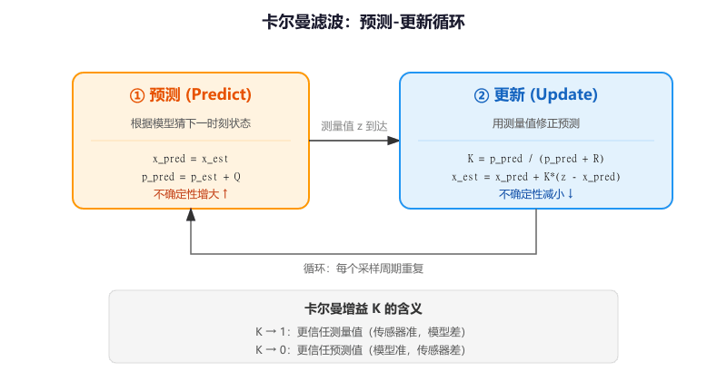
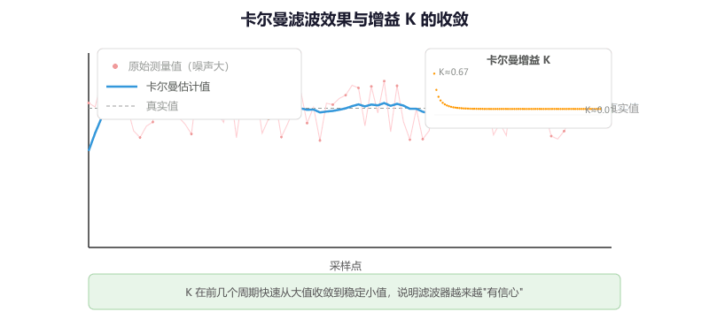
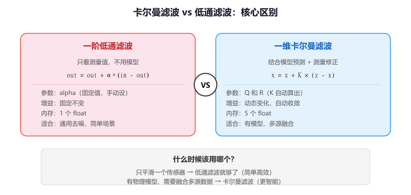

# 第 4 节 · 让估计比测量更稳：卡尔曼滤波

> 本节目标：理解卡尔曼滤波为什么能比单纯的测量更准，掌握"预测-更新"两步循环的直觉含义，能在 STM32 上实现一维卡尔曼滤波并用于传感器数据处理。

> 如有对应的推荐教程，将在上方出现跳转按钮，可以按需选择观看

## 它和低通滤波有什么区别

第 2 节学的低通滤波是"压噪声"——它不关心数据背后的物理规律，只是机械地把高频成分压掉。这在很多场景下够用了，但有些时候你需要更聪明的方法。

想象你在测量一辆匀速行驶的小车的位置。你有两个信息来源：

1. **模型预测**：小车上一秒在 100m，速度是 10m/s，所以这一秒应该在 110m
2. **传感器测量**：GPS 说小车在 108m（GPS 有误差）

低通滤波只会看到 108 这个数字，然后和上次的输出做加权平均。但卡尔曼滤波会**同时考虑模型预测和传感器测量**，根据各自的可信度来融合，得到一个比两者都更准的估计值。

**卡尔曼滤波的核心思想：结合"我觉得应该是多少"（模型预测）和"我测到的是多少"（传感器测量），根据各自的不确定性来加权融合，得到最优估计。**

那么这里有个问题，既然低通滤波已经能平滑数据了，那我什么时候需要用卡尔曼滤波？

答案是当你有一个**可用的物理模型**时。如果你知道系统的运动规律（比如匀速、匀加速、角速度积分得到角度），卡尔曼滤波可以利用这个模型来"预测"下一时刻的状态，然后用测量值来"修正"预测。这样做的好处是：即使传感器暂时丢数据或者噪声很大，模型预测也能撑住，输出不会突然跳变。

## 预测-更新：两步循环

卡尔曼滤波的每个周期只做两件事，反复循环：

```
  ┌──────────────────────────────────────────┐
  │                                          │
  ▼                                          │
┌──────────┐    ┌──────────┐    ┌──────────┐ │
│ 1. 预测  │───>│ 2. 更新  │───>│ 输出估计 │─┘
│ (Predict)│    │ (Update) │    │   结果   │
└──────────┘    └──────────┘    └──────────┘
  用模型猜        用测量修正
```

### 第一步：预测（Predict）

根据物理模型，猜测当前时刻的状态应该是多少。同时，因为模型不完美，预测的不确定性会增大。

通俗地讲：**"根据上次的状态和运动规律，我猜这次应该是 X，但我不太确定，误差可能有这么大。"**

### 第二步：更新（Update）

拿到传感器的测量值后，把预测值和测量值融合。谁的不确定性小，就更相信谁。融合后，不确定性会减小。

通俗地讲：**"传感器说是 Y，我猜的是 X。传感器噪声大还是我的预测误差大？谁更靠谱就偏向谁。"**

融合的权重叫做**卡尔曼增益（Kalman Gain，K）**：

- K 接近 1：更相信测量值（传感器准、模型差）
- K 接近 0：更相信预测值（模型准、传感器差）



## 一维卡尔曼滤波的公式

先从最简单的一维情况入手。假设你要估计一个缓慢变化的量（比如温度），只有一个传感器在测量。

整个算法只有 5 个公式，分成预测和更新两组：

### 预测阶段

```
x_pred = x_est                    // 预测状态 = 上次的估计值（假设不变）
p_pred = p_est + Q                // 预测不确定性 = 上次不确定性 + 过程噪声
```

### 更新阶段

```
K = p_pred / (p_pred + R)         // 卡尔曼增益
x_est = x_pred + K * (z - x_pred) // 更新估计值（z 是测量值）
p_est = (1 - K) * p_pred          // 更新不确定性
```

其中：
- `x_est`：估计值（算法的输出）
- `p_est`：估计的不确定性（越小说明越有信心）
- `Q`：**过程噪声**——模型有多不准。Q 越大，说明你越不信任模型
- `R`：**测量噪声**——传感器有多不准。R 越大，说明你越不信任传感器
- `z`：传感器的测量值
- `K`：卡尔曼增益——自动计算出来的融合权重

**Q 和 R 是你需要调的两个参数**，它们的比值决定了算法更信任模型还是更信任传感器。

## 完整实现

### 结构体定义

```c
typedef struct {
    float x_est;      // 状态估计值
    float p_est;      // 估计不确定性（误差协方差）
    float Q;          // 过程噪声（模型不确定性）
    float R;          // 测量噪声（传感器不确定性）
    float K;          // 卡尔曼增益（自动计算）
} Kalman1D_t;
```

### 初始化函数

```c
// 初始化一维卡尔曼滤波器
// Q：过程噪声，越大越信任测量值
// R：测量噪声，越大越信任模型预测
void Kalman1D_Init(Kalman1D_t *kf, float Q, float R)
{
    kf->x_est = 0.0f;
    kf->p_est = 1.0f;    // 初始不确定性设为 1（表示"不太确定"）
    kf->Q     = Q;
    kf->R     = R;
    kf->K     = 0.0f;
}
```

### 更新函数

```c
// 每次有新的测量值时调用
// measurement：传感器测量值
// 返回值：卡尔曼滤波后的估计值
float Kalman1D_Update(Kalman1D_t *kf, float measurement)
{
    // ===== 预测阶段 =====
    // 一维简单情况：预测值 = 上次估计值（假设状态不变）
    float x_pred = kf->x_est;
    float p_pred = kf->p_est + kf->Q;

    // ===== 更新阶段 =====
    // 计算卡尔曼增益
    kf->K = p_pred / (p_pred + kf->R);

    // 融合预测和测量
    kf->x_est = x_pred + kf->K * (measurement - x_pred);

    // 更新不确定性
    kf->p_est = (1.0f - kf->K) * p_pred;

    return kf->x_est;
}
```

你会发现，更新阶段的核心公式 `x_est = x_pred + K * (measurement - x_pred)` 和低通滤波的公式 `output = output + alpha * (input - output)` 长得几乎一样。区别在于：低通滤波的 alpha 是你手动设的固定值，而卡尔曼增益 K 是**根据不确定性自动计算的**，会随着运行动态变化。



## Q 和 R 怎么调

Q 和 R 的**比值**决定了滤波行为：

| Q/R 比值 | 行为 | 适合场景 |
| --- | --- | --- |
| Q/R 很大（如 10） | 更信任测量值，响应快，但不够平滑 | 传感器精度高、系统变化快 |
| Q/R ≈ 1 | 预测和测量各占一半 | 通用场景 |
| Q/R 很小（如 0.1） | 更信任模型预测，输出平滑，但响应慢 | 传感器噪声大、系统变化慢 |

### 实际调参方法

1. **先估计 R**：让传感器静止不动，采集一段数据，算方差。比如 ADC 静止时读数在 2040~2060 之间跳动，方差大约是 100，那 R 就设 100
2. **再调 Q**：从一个小值开始（比如 0.01），逐渐增大，观察输出的平滑度和响应速度，找到满意的平衡点

```c
// 传感器噪声大、信号变化慢的场景（比如温度）
Kalman1D_Init(&kf, 0.01f, 10.0f);   // Q 小 R 大 → 重度平滑

// 传感器还行、信号变化快的场景（比如 IMU 角速度）
Kalman1D_Init(&kf, 1.0f, 5.0f);     // Q 和 R 接近 → 适度平滑

// 传感器很准、需要快速跟踪的场景
Kalman1D_Init(&kf, 5.0f, 1.0f);     // Q 大 R 小 → 轻度平滑
```

## 在 STM32 上使用：ADC 采样滤波

```c
// 全局变量
Kalman1D_t adc_kalman;

// main 函数里初始化
Kalman1D_Init(&adc_kalman, 0.1f, 50.0f);
HAL_TIM_Base_Start_IT(&htim2);

// 定时器中断回调
void HAL_TIM_PeriodElapsedCallback(TIM_HandleTypeDef *htim)
{
    if (htim->Instance == TIM2)
    {
        HAL_ADC_Start(&hadc1);
        HAL_ADC_PollForConversion(&hadc1, 10);
        uint16_t raw = HAL_ADC_GetValue(&hadc1);

        float filtered = Kalman1D_Update(&adc_kalman, (float)raw);

        // 用滤波后的值
        __HAL_TIM_SET_COMPARE(&htim3, TIM_CHANNEL_1, (uint16_t)filtered);
    }
}
```

## 卡尔曼滤波 vs 低通滤波：什么时候该用哪个

| 特性 | 一阶低通 | 一维卡尔曼 |
| --- | --- | --- |
| 参数 | alpha（手动设定，固定） | Q 和 R（增益 K 自动计算） |
| 是否利用模型 | 不利用 | 利用（预测阶段） |
| 增益是否动态变化 | 固定 | 动态（收敛后趋于稳定） |
| 实现复杂度 | 极简（1 行） | 简单（5 行） |
| 适合场景 | 通用去噪 | 有模型可用、需要融合多源信息 |

**入门建议**：如果你只是想平滑一个传感器的数据，低通滤波就够了。如果你需要融合两个传感器（比如编码器 + IMU 估计角度），或者你有一个物理模型可以做预测，那就该用卡尔曼滤波。



## 从一维到多维（预告）

本节讲的是最简单的一维卡尔曼。在实际项目中，你经常需要同时估计多个状态（比如位置和速度），这时候就需要**多维卡尔曼滤波**，公式里的标量变成矩阵。核心思路完全一样——预测、更新、融合——只是数学表达更复杂。

先把一维的理解透，再扩展到多维就不难了。第四章讲 IMU 姿态估计时会用到多维版本。

## 常见问题排查

| 现象 | 原因 |
| --- | --- |
| 输出几乎不动，跟不上变化 | R 太大或 Q 太小，算法过度信任模型预测 |
| 输出和原始数据一样抖 | Q 太大或 R 太小，算法过度信任测量值 |
| 上电后输出从 0 慢慢爬升 | 初始 x_est 是 0，需要几个周期收敛。可以把第一次测量值直接赋给 x_est |
| 效果和低通滤波差不多 | 一维简单场景下确实差不多，卡尔曼的优势在多维和有模型的场景 |
| K 值一直在变 | 正常现象，K 会在前几个周期快速收敛，之后趋于稳定 |

## 本章任务

用你手里的小蓝板实现：

1. 用一维卡尔曼滤波器处理 ADC 采样数据，通过串口同时打印原始值、卡尔曼输出和卡尔曼增益 K，观察 K 如何从大逐渐收敛到稳定值
2. 分别用 Q=0.01/R=100、Q=1/R=10、Q=10/R=1 三组参数做实验，对比滤波效果，理解 Q/R 比值的影响
3. 同时运行低通滤波和卡尔曼滤波，用串口绘图工具对比两者的输出曲线
4. （进阶）实现"自适应初始化"：第一次调用时把 x_est 设为测量值、p_est 设为 R，让滤波器跳过冷启动阶段
