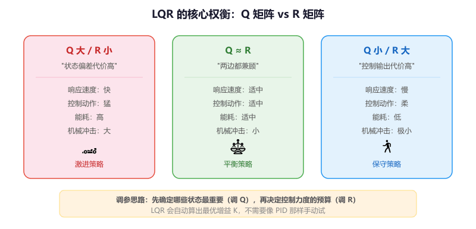
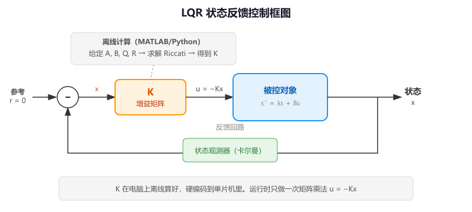
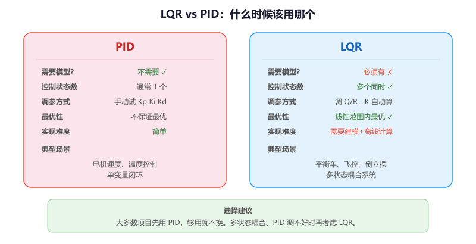

# 第 5 节 · 先定义代价再求最优：LQR 线性二次调节器

> 本节目标：理解 LQR 的核心思想——"先定义什么是好的，再让数学帮你找最优解"，知道 Q 和 R 矩阵如何影响控制行为，了解它在平衡车、倒立摆等系统中的典型应用。

> 如有对应的推荐教程，将在上方出现跳转按钮，可以按需选择观看

## LQR 和 PID 有什么区别

PID 的思路是：**看到误差，就去纠正**。它只关心一个误差信号，通过调 Kp、Ki、Kd 三个参数来决定纠正的力度。

LQR 的思路完全不同：**先定义"什么样的控制是好的"，然后用数学方法算出最优的反馈增益**。它同时考虑多个状态变量（位置、速度、角度、角速度……），而不是只盯着一个误差。

通俗地讲，PID 像一个凭经验开车的老司机——看到偏了就打方向盘，偏多少打多少，全靠手感。LQR 像一个装了导航系统的自动驾驶——它知道车的动力学模型，知道每个操作的代价，然后计算出一条最优路径。

那么这里有个问题，既然 PID 已经能做闭环控制了，那我什么时候需要用 LQR？

答案是当你的系统有**多个需要同时控制的状态变量**时。比如平衡车：你不仅要控制倾斜角度，还要控制角速度、车轮位置、车轮速度——这四个状态互相耦合，用单个 PID 很难同时兼顾。LQR 天然支持多状态反馈，一次性算出所有状态对应的反馈增益，效果通常比多个 PID 串联或并联要好。

## 核心思想：代价函数

LQR 的全称是 **Linear Quadratic Regulator**（线性二次调节器）。它的核心是定义一个**代价函数（Cost Function）**：

```
总代价 = ∑ (状态偏差的代价 + 控制输出的代价)
```

用大白话说就是两条规则：

- **状态偏差太大要罚**：角度偏了 10 度比偏了 1 度代价高
- **控制输出太猛也要罚**：电机全力输出比温和输出代价高

LQR 的目标就是找到一组反馈增益，让这个总代价**最小**。

```
  "我要角度回到 0"  ←──── 状态偏差代价（Q 矩阵控制）
         vs
  "但我不想电机太猛" ←──── 控制输出代价（R 矩阵控制）
         ↓
  LQR 帮你找到最优平衡点
```

### Q 矩阵：哪些状态更重要

Q 矩阵决定了你对每个状态偏差的"容忍度"。Q 里某个对角元素越大，说明你越不能容忍对应状态的偏差，LQR 就会更积极地纠正它。

比如平衡车有 4 个状态：角度、角速度、位置、速度。

```
Q = | 100   0    0    0  |    角度偏差：非常重要（100）
    |  0   10    0    0  |    角速度偏差：比较重要（10）
    |  0    0    1    0  |    位置偏差：不太重要（1）
    |  0    0    0    1  |    速度偏差：不太重要（1）
```

这组 Q 的意思是：**角度是最重要的，宁可位置偏一点，也要保证不倒**。

### R 矩阵：控制动作有多贵

R 矩阵决定了你对控制输出的"吝啬程度"。R 越大，LQR 越不愿意用大的控制输出，结果就是动作更温和但响应更慢。

```
R 小（如 0.1）：不在乎电机使劲 → 响应快、动作猛
R 大（如 100）：很在乎电机使劲 → 响应慢、动作柔
```

**Q 和 R 的比值决定了控制风格**——和卡尔曼滤波里 Q/R 的思路类似。



## 状态空间模型：LQR 的前提

LQR 需要一个**线性状态空间模型**，用两个矩阵 A 和 B 描述系统：

```
x(k+1) = A * x(k) + B * u(k)

x：状态向量（比如 [角度, 角速度, 位置, 速度]）
u：控制输入（比如电机电压）
A：系统矩阵（描述状态如何自然演化）
B：输入矩阵（描述控制输入如何影响状态）
```

通俗地讲：A 描述"如果你什么都不做，系统会怎么变"，B 描述"你的控制动作会怎么影响系统"。

**这是 LQR 和 PID 最大的区别**：PID 不需要模型，只看误差；LQR 必须有模型，模型不准，控制效果就差。

## LQR 的计算结果：增益矩阵 K

给定 A、B、Q、R 四个矩阵，LQR 通过求解一个叫 **Riccati 方程**的数学问题，算出一个最优反馈增益矩阵 K。然后控制律就是：

```
u = -K * x
```

就这么简单——把当前状态乘以 K，取负号，就是控制输出。

以平衡车为例：

```c
// K 是离线算好的增益矩阵（1×4，因为 1 个控制输入、4 个状态）
// K = [K1, K2, K3, K4]
float K[4] = {-50.0f, -5.0f, -1.0f, -2.0f};

// 状态向量
float angle;          // 倾斜角度（rad）
float angular_vel;    // 角速度（rad/s）
float position;       // 车轮位置（m）
float velocity;       // 车轮速度（m/s）

// LQR 控制律：u = -K * x
float control_output = -(K[0] * angle
                       + K[1] * angular_vel
                       + K[2] * position
                       + K[3] * velocity);
```

**注意**：K 矩阵通常不在单片机上实时计算（Riccati 方程的求解计算量很大），而是在电脑上用 MATLAB 或 Python 离线算好，然后把 K 的数值硬编码到单片机代码里。



## 用 MATLAB / Python 计算 K

### MATLAB

```
A = [0 1 0 0; 49.0 0 0 0; 0 0 0 1; -1.96 0 0 0];
B = [0; -8.0; 0; 2.0];
Q = diag([100, 10, 1, 1]);
R = 1;
K = lqr(A, B, Q, R);
```

### Python（需要安装 scipy）

```
import numpy as np
from scipy.linalg import solve_continuous_are

A = np.array([[0,1,0,0],[49.0,0,0,0],[0,0,0,1],[-1.96,0,0,0]])
B = np.array([[0],[-8.0],[0],[2.0]])
Q = np.diag([100, 10, 1, 1])
R = np.array([[1]])

P = solve_continuous_are(A, B, Q, R)
K = np.linalg.inv(R) @ B.T @ P
print("K =", K)
```

算出来的 K 是一组数字，直接复制到 C 代码里用。

## 完整的 STM32 实现框架

```c
// LQR 增益（从 MATLAB/Python 算出来的）
#define LQR_STATE_DIM  4    // 状态维度
#define LQR_INPUT_DIM  1    // 控制输入维度

typedef struct {
    float K[LQR_INPUT_DIM * LQR_STATE_DIM];  // 增益矩阵
    float max_output;                          // 输出限幅
} LQR_t;

void LQR_Init(LQR_t *lqr, const float *K, float max_output)
{
    for (int i = 0; i < LQR_INPUT_DIM * LQR_STATE_DIM; i++)
        lqr->K[i] = K[i];
    lqr->max_output = max_output;
}

// state：当前状态向量 [angle, angular_vel, position, velocity]
// 返回值：控制输出
float LQR_Update(LQR_t *lqr, const float *state)
{
    float output = 0.0f;

    // u = -K * x
    for (int i = 0; i < LQR_STATE_DIM; i++)
        output -= lqr->K[i] * state[i];

    // 输出限幅
    if (output >  lqr->max_output) output =  lqr->max_output;
    if (output < -lqr->max_output) output = -lqr->max_output;

    return output;
}
```

### 使用示例

```c
// 从 MATLAB 算出的增益
float K_values[4] = {-50.0f, -5.0f, -1.0f, -2.0f};

LQR_t balance_lqr;
LQR_Init(&balance_lqr, K_values, 999.0f);

// 定时器中断里（比如 5ms 一次）
void HAL_TIM_PeriodElapsedCallback(TIM_HandleTypeDef *htim)
{
    if (htim->Instance == TIM2)
    {
        // 获取当前状态（从传感器和估计器）
        float state[4];
        state[0] = IMU_GetAngle();         // 倾斜角度
        state[1] = IMU_GetAngularVel();    // 角速度
        state[2] = Encoder_GetPosition();  // 车轮位置
        state[3] = Encoder_GetVelocity();  // 车轮速度

        // LQR 计算控制输出
        float output = LQR_Update(&balance_lqr, state);

        // 输出到电机
        Motor_SetVoltage(output);
    }
}
```

## LQR vs PID：什么时候该用哪个

| 特性 | PID | LQR |
| --- | --- | --- |
| 需要模型吗 | 不需要 | 必须有线性模型 |
| 控制几个状态 | 通常 1 个误差 | 可以同时控制多个状态 |
| 调参方式 | 手动试（Kp, Ki, Kd） | 调 Q/R 矩阵，K 自动算出 |
| 最优性 | 不保证最优 | 在线性范围内数学最优 |
| 实现难度 | 简单 | 需要建模 + 离线计算 |
| 适合场景 | 单变量控制（速度、温度） | 多变量耦合系统（平衡车、飞控） |

**入门建议**：大多数项目先用 PID，够用就不换。当你发现系统有多个耦合状态、单个 PID 调不好时，再考虑 LQR。



## 学习时别急着背矩阵

很多教材一上来就是满屏的矩阵推导，把人吓跑了。你真正要先理解的是三件事：

1. **哪些状态最重要**——Q 矩阵里对应的值就设大一点
2. **控制动作有多贵**——R 大就温和，R 小就激进
3. **为什么"快"不一定等于"好"**——控制太猛会烧电机、费电池、产生机械冲击

理解了这三点，再去看矩阵公式就不再是天书了。

## 工程提醒

**模型准确性是关键**：LQR 建立在模型足够准确的前提下。如果你的 A、B 矩阵和实际系统差距很大，算出来的 K 就不好用。实际项目中通常需要通过系统辨识或反复调整来获得准确的模型参数。

**线性化的局限**：LQR 要求系统是线性的。但真实系统（比如倒立摆）通常是非线性的，需要在工作点附近做线性化。这意味着 LQR 只在工作点附近有效——角度偏太大，线性化就不准了，控制效果会急剧下降。

**通常不单独使用**：LQR 需要知道完整的状态向量，但有些状态不能直接测量（比如速度可能需要从位置微分得到）。所以 LQR 通常和**状态观测器**（比如卡尔曼滤波）一起使用——卡尔曼负责估计状态，LQR 负责计算控制。

## 常见问题排查

| 现象 | 原因 |
| --- | --- |
| 平衡车完全不平衡 | K 值算错了；或者状态变量的符号/单位不对；或者传感器数据方向接反 |
| 能短暂平衡但很快倒 | 模型不准确，需要重新辨识 A、B 矩阵；或者控制频率太低 |
| 平衡但一直在抖 | 传感器噪声太大，需要先用卡尔曼滤波处理状态估计 |
| 平衡但会慢慢漂移 | Q 矩阵里位置项的权重太小，LQR 不够重视位置偏差 |
| 电机声音很大、发热 | R 太小，控制输出太激进；增大 R 让动作更温和 |

## 本章任务

1. 在纸上画出平衡车的状态变量（角度、角速度、位置、速度），标出哪些可以直接测量、哪些需要估计
2. 用 MATLAB 或 Python 计算一组简单系统的 LQR 增益 K，改变 Q 和 R 的值，观察 K 如何变化，建立直觉
3. （进阶）如果你有平衡车或倒立摆硬件，尝试把离线算出的 K 写入 STM32，配合 IMU 和编码器实现 LQR 平衡控制
4. （进阶）对比同一个系统用 PID 和 LQR 控制的效果差异，记录超调量、稳定时间和控制输出的平滑度
